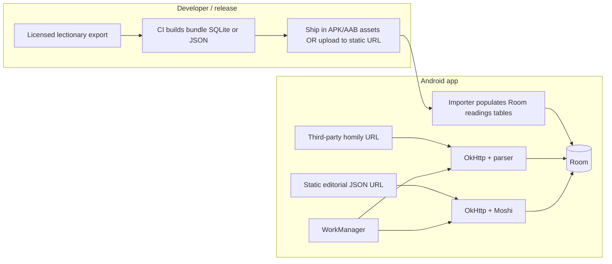

# Catholic Daily App — Data architecture & pipeline

**Status:** Draft engineering spec (aligns with `catholic-daily-app-v1-prd.md` §5.2–5.4, §5.7).  
**Last updated:** 2026-04-06  
**V1 deployment model:** **App-only** — no first-party **Content API** or app backend. All persistence is **on-device (Room)**; the app **ingests** readings from a **bundled or statically hosted** artifact and **fetches** homily + editorial **directly** from **allowed third-party URLs** (or **static JSON** you publish without a custom server, e.g. object storage + CDN).

---

## 0. App-only scope (what this means)

| In scope (V1) | Out of scope (V1) |
|---------------|-------------------|
| **Room** database on the phone (schema in §3) | Your own REST API tier |
| **Readings** in `assets/` or downloaded **static file** (version in manifest JSON on same static host) | Server-side normalization workers |
| **Homily** via **Retrofit/OkHttp** to **official** RSS/JSON/HTML **if terms allow**, parsed in-app into `homily_document` | Scraping pipelines you operate centrally |
| **Editorial** via **static** `editorial/YYYY-MM-DD.json` (or one **index.json** + lazy files) on **Firebase Hosting / S3+CloudFront / GitHub raw** — no compute | CMS webhooks hitting your API |
| **WorkManager** periodic refresh + refresh on app open | Postgres / “homily worker” in cloud |

**Trust boundary:** Third-party responses are **validated** (schema, size limits, TLS pinning optional) then **stored** as cache. UI still shows **source URL** and **fetched_at** / **published_at** per PRD.

---

## 1. Three content types (treatment summary)

| Domain | Nature | Primary source of truth | Refresh model |
|--------|--------|-------------------------|---------------|
| **A — Mass readings** | Deterministic from **KWI liturgical calendar** + lectionary cycle | Licensed **Indonesian lectionary text** (e.g. partner API export, approved bulk file) | **Versioned bundle** in-app or via CDN; **not** a daily live scrape. Optional **correction manifest** when the partner publishes fixes. |
| **B — Pope homily** | Event-driven (not every calendar day) | **Holy See / licensed** channel (API, RSS, partner CMS) — **no scraping as default** (per PRD FR-9). | **Pull on schedule** + **on-demand** when app opens; cache with **honest stale** semantics (PRD FR-22). |
| **C — Editorial (*renungan*)** | Curated | **Static JSON** you publish (from any CMS/export) + rights metadata in file | **Publish workflow** offline of the app (draft → reviewed → **upload file**); app **GET**s by `liturgical_date`. |

**Design principle:** The **mobile app** treats **A** as “local-first after sync,” **B** and **C** as “API-first with TTL + fallback to last good copy,” with **source and last_updated** exposed where policy requires (PRD FR-7, FR-20).

---

## 2. Logical model (entities)

- **Readings bundle** — One row per shipped dataset: `bundle_version`, `effective_from`, `source_attribution`, `checksum`.
- **Liturgical day** — Keyed by **conference** (default KWI), **civil date in user TZ** resolution, and **computed liturgical identity** (e.g. memorial ID / Sunday cycle) as provided by your calendar engine or partner data.
- **Reading blocks** — Ordered sections for that day: First Reading, Psalm, Second Reading (optional), Gospel — each with `reference`, `title`, `body`, `kind`.
- **Homily** — Latest-or-dated document: `homily_date`, `language`, `body` or `rights_mode` (full / excerpt / link_only), `source_url`, `fetched_at`.
- **Editorial** — One primary piece per **liturgical day** (or per **publish id**): `byline`, `body`, `review_flags`, optional `ai_assisted` disclosure.

---

## 3. SQLite schema (Room on-device)

Single **Room** database (or **readings** prebuilt `.db` in `assets/` copied/imported at first launch). Types are SQLite; in Room, map `TEXT` to `String`, `INTEGER` to `Long`/`Boolean`, store JSON in `TEXT` if you prefer flexible blocks.

```sql
-- A: Versioned readings dataset (replace or attach new bundle when version changes)
CREATE TABLE readings_bundle (
  id INTEGER PRIMARY KEY AUTOINCREMENT,
  bundle_version TEXT NOT NULL UNIQUE,
  conference_code TEXT NOT NULL DEFAULT 'KWI',
  effective_from TEXT NOT NULL, -- ISO-8601 date
  source_attribution TEXT NOT NULL,
  content_license_tag TEXT,
  sha256 TEXT NOT NULL,
  installed_at TEXT NOT NULL DEFAULT (datetime('now'))
);

-- One row per liturgical "day" inside a bundle (index for fast lookup by date)
CREATE TABLE readings_day (
  id INTEGER PRIMARY KEY AUTOINCREMENT,
  bundle_id INTEGER NOT NULL REFERENCES readings_bundle(id) ON DELETE CASCADE,
  liturgical_date TEXT NOT NULL, -- resolved "church day" for Indonesia UX; define TZ rules in app
  cycle_metadata TEXT, -- JSON: sunday_year ABC, weekday_year I/II, feast id, etc.
  UNIQUE (bundle_id, liturgical_date)
);

CREATE TABLE reading_block (
  id INTEGER PRIMARY KEY AUTOINCREMENT,
  readings_day_id INTEGER NOT NULL REFERENCES readings_day(id) ON DELETE CASCADE,
  sort_order INTEGER NOT NULL,
  kind TEXT NOT NULL CHECK (kind IN ('FIRST','PSALM','SECOND','GOSPEL')),
  reference TEXT,
  title TEXT,
  body TEXT NOT NULL,
  source_line TEXT,
  UNIQUE (readings_day_id, kind, sort_order)
);

CREATE INDEX idx_readings_day_lookup ON readings_day (liturgical_date);
CREATE INDEX idx_readings_day_bundle ON readings_day (bundle_id, liturgical_date);

-- B: Homily (network-backed; keep history for rollback / audit)
CREATE TABLE homily_document (
  id INTEGER PRIMARY KEY AUTOINCREMENT,
  external_id TEXT UNIQUE,
  homily_date TEXT NOT NULL,
  title TEXT,
  language TEXT NOT NULL,
  body TEXT,
  rights_mode TEXT NOT NULL CHECK (rights_mode IN ('FULL','EXCERPT','LINK_ONLY')),
  source_url TEXT NOT NULL,
  source_name TEXT,
  fetched_at TEXT NOT NULL,
  content_sha256 TEXT,
  is_latest INTEGER NOT NULL DEFAULT 0
);

CREATE INDEX idx_homily_latest ON homily_document (is_latest, homily_date DESC);

-- C: Editorial / renungan
CREATE TABLE editorial_piece (
  id INTEGER PRIMARY KEY AUTOINCREMENT,
  external_id TEXT UNIQUE,
  liturgical_date TEXT NOT NULL,
  title TEXT,
  body TEXT NOT NULL,
  byline TEXT NOT NULL,
  language TEXT NOT NULL DEFAULT 'id',
  ai_assisted INTEGER NOT NULL DEFAULT 0,
  human_reviewed INTEGER NOT NULL DEFAULT 0,
  published_at TEXT NOT NULL,
  source_attribution TEXT,
  content_sha256 TEXT,
  UNIQUE (liturgical_date, language)
);

-- Sync / honesty metadata for offline and "last updated" UI
CREATE TABLE content_sync_state (
  key TEXT PRIMARY KEY,
  value TEXT NOT NULL,
  updated_at TEXT NOT NULL DEFAULT (datetime('now'))
);
-- Suggested keys: readings_bundle_version, homily_last_fetch_at, editorial_last_fetch_at,
-- optional editorial_index_etag (static host), readings_bundle_remote_etag
```

**Indexes you may add later:** full-text (`FTS5`) on `reading_block.body`, `homily_document.body`, `editorial_piece.body` if you need search; not required for V1 scroll.

---

## 4. Data pipeline (app-only)



### 4.1 Readings (A)

1. **Obtain** periodic dump from the **rights-cleared** Indonesian lectionary source (KWI-consistent).
2. **Validate** in CI; **emit** `readings_bundle` + days + blocks as **prebuilt Room DB** or **JSON** the app imports once.
3. **Ship** inside the **AAB** (simplest) **or** host `readings-v2026.1.zip` + tiny `readings-manifest.json` on a **static** host; app compares `bundle_version` to local and downloads **without** any app-owned API layer.

### 4.2 Homily (B)

1. App holds **configured base URL(s)** (`buildConfigField` or **Firebase Remote Config** only as *URL pointers*, not as your content database).
2. **Fetch** on schedule + on open; **parse** RSS/Atom/JSON in-app (whatever the **licensed** source provides).
3. **Map** into `homily_document`; set `rights_mode` from **legal** decision (fixed per source), not from heuristics.
4. **If** no stable machine feed exists, V1 fallback: **link-only** state with `source_url` and empty `body` — still no backend required.

### 4.3 Editorial (C)

1. **Publish** by dropping **`editorial/{date}.json`** (or appending to **`editorial-index.json`**) on static hosting — export from your CMS manually or via CMS “publish to S3” plugin.
2. App **GET**s index or direct file; **upsert** `editorial_piece`; store **HTTP Last-Modified / ETag** in `content_sync_state` for conditional `If-None-Match` requests.

---

## 5. Contracts without a first-party API

Use **small static JSON** you control plus **third-party** responses as-is:

**Readings manifest (optional, static host):**

```json
{
  "readings_bundle_version": "2026.1.0",
  "bundle_url": "https://cdn.example/readings-2026.1.db.zip",
  "sha256": "…",
  "min_app_version": "1.0.0"
}
```

**Editorial file (per day or batch):**

```json
{
  "liturgical_date": "2026-04-06",
  "title": "…",
  "body": "…",
  "byline": "Tim redaksi",
  "published_at": "2026-04-05T18:00:00+07:00",
  "ai_assisted": false,
  "source_attribution": "…"
}
```

**Homily:** No generic schema — define **one parser per allowed source** after legal review; persisted rows always match `homily_document` columns.

Use **`If-None-Match`** / **`If-Modified-Since`** against static hosts to save bandwidth.

---

## 6. Android implementation notes

- **Room** is the **single** content store; **no** Retrofit base URL to `yourapp.com/api`.
- **`ContentRepository`:** `readingsFlow(liturgicalDate)` from Room; `refreshHomily()` / `refreshEditorial(date)` call network datasources, then **DAO upsert**; expose **`NetworkResult` + last success timestamps** for honest UI (PRD FR-22).
- **Importer:** one-shot **use case** on upgrade when `bundle_version` changes; run on a **background** thread with progress for large downloads.
- **Security:** certificate pinning optional for fixed CDN; **cap response size** for parsers; **do not** use `WebView` extraction for homily as the default ingestion path (policy).

---

## 7. Security & compliance hooks

- Store **no PII** in these tables for V1 content DB.
- Log **ingest source** and **license tag** on `readings_bundle` and homily/editorial rows for audits.
- **Homily** rows: never fabricate “official Indonesian” via MT in DB; language and `rights_mode` must reflect what was **actually published** (see context doc).

---

## 8. Next steps (product + engineering)

1. **Legal:** Confirm readings partner, homily reuse mode, share snippet limits — then lock `rights_mode` enums and **per-source** homily parser behavior.
2. **CI:** Script that turns licensed lectionary export → **importable bundle** (`bundle_version` + checksum); attach to release or upload to static storage. **Repo starter:** `Catholic Daily App/pipeline/` (schemas, samples, `build_readings_bundle.py`, `validate_content_assets.py`).
3. **App:** Room + DAOs + **WorkManager** policies (intervals, constraints); **static JSON** shape for editorial; **one** `HomilyDataSource` implementation per allowed URL pattern.

Related: `catholic-daily-app-context.md` (sources), `catholic-daily-app-v1-prd.md` §5 (FRs), `catholic-daily-app-packaging-to-production.md` (Play + CDN packaging).
