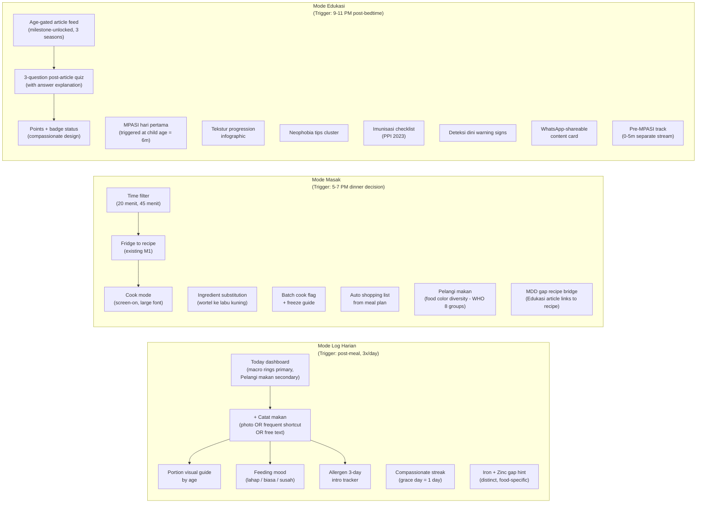

# Suppa — Vision & Feature Brainstorm

**Status:** Living document — update as decisions are made
**Created:** 2026-04-09
**Last reviewed:** 2026-04-09 (CPO · Designer · PO post-research stress-test)
**Owner:** Alvin
**Session agents:** CPO · Designer · Product Owner · Researcher

> This document captures the expanded vision-mission tree, mode-based feature map, seed data needs, and research agenda for Suppa. It is the strategic complement to `[child-nutrition-app-context.md](../child-nutrition-app-context.md)` and lives above M1 spec scope.
>
> **Research inputs incorporated:**
> `[suppa-user-behavior-research-2026-04-09.md](../Research%20Result/suppa-user-behavior-research-2026-04-09.md)` ·
> `[suppa-nutrition-science-research-2026-04-09.md](../Research%20Result/suppa-nutrition-science-research-2026-04-09.md)` ·
> `[suppa-product-market-research-2026-04-09.md](../Research%20Result/suppa-product-market-research-2026-04-09.md)`

---

## Resolved Decisions

| #         | Decision                   | Choice                                      | Rationale                                                                         | Research validation                                                                                                                                                               |
| --------- | -------------------------- | ------------------------------------------- | --------------------------------------------------------------------------------- | --------------------------------------------------------------------------------------------------------------------------------------------------------------------------------- |
| 1         | Mode switching             | **Explicit** — 3 tabs in bottom nav         | Simpler to build; gives moms a clear mental model                                 | Confirmed — user behavior research shows time-anchored (Dewi/Ratna) and event-triggered (Siti/Linda) patterns both served by explicit tabs                                        |
| 2         | Gamification depth         | **Low effort** — streaks + badges only      | Reasonable retention, low design/backend cost                                     | Confirmed — nutrition science research validates streaks and post-article quizzes specifically. New requirement: **compassionate streak** (grace day built in)                    |
| 3         | Product positioning        | **Education platform that also tracks**     | Mode Edukasi is first-class; tracking serves learning goals                       | Confirmed — research shows knowledge-practice gap is the core problem; Suppa must bridge it via Mode Masak companion. Education alone is insufficient without action scaffolding. |
| 4 *(new)* | Nutrient tracking priority | **Iron + Zinc as primary gap indicators**   | Research confirms zinc (#1, 38.7%) and iron (#2, 34.2%) are dominant deficiencies | SEANUTS II + Bandung study — these two nutrients must be first-class in the tracking model                                                                                        |
| 5 *(new)* | IDAI content alignment     | **Pursue informal alignment before launch** | Credibility prerequisite; PrimaKu already holds full IDAI endorsement             | Product-market research — named IDAI-affiliated advisor is minimum bar for clinical channel distribution and user trust                                                           |
| 6 *(new)* | Revenue path               | **B2B2C before B2C subscription**           | Indonesian WTP is low; ad-free + free base is the trust-building phase            | Market research — brand-sponsored educational content (Phase 2), institutional Posyandu (Phase 3), optional premium (Phase 4)                                                     |

---

## 1. Vision-Mission Tree (Expanded)

> **CPO review note:** Two updates from research. (1) M4 label updated — zinc is now explicitly named as #1 priority deficiency, not iodine as originally suspected. (2) New sub-node added under M1 — "Menjembatani knowledge → action" — research confirms the knowledge-practice gap is the primary behavioral barrier for Indonesian MPASI moms. Knowing and doing are not the same; the app must own the bridge.

```mermaid
graph TD
    Vision["VISION\nNutrisi semua anak tercukupi"]

    Vision --> M1["Educated Mom"]
    Vision --> M2["Anak menerima\nmakanan dengan baik"]
    Vision --> M3["Anak Sehat Jasmani"]
    Vision --> M4["Nutrisi tercukupi"]
    Vision --> M5["Membantu orang tua"]
    Vision --> M6["Keterlibatan keluarga"]

    M1 --> M1a["Literasi nutrisi\n(labels, food groups)"]
    M1 --> M1b["Kebersihan alat makan"]
    M1 --> M1c["Kepercayaan diri ibu\n(self-efficacy)"]
    M1 --> M1d["Komunitas peer\n(WhatsApp-first)"]
    M1 --> M1e["Deteksi dini masalah gizi\n(when to see a doctor)"]
    M1 --> M1f["Menjembatani knowledge\nke action\n(Mode Masak + Edukasi linked)"]

    M2 --> M2a["Presentasi makanan"]
    M2 --> M2b["Tekstur makan\n(progression by age)"]
    M2 --> M2c["Kesehatan oreomolar"]
    M2 --> M2d["Sensory exploration\n(warna, aroma, rasa)"]
    M2 --> M2e["Jadwal makan sesuai usia"]
    M2 --> M2f["Dukungan neophobia\n(10-15 exposure rule)"]

    M3 --> M3a["Grafik pertumbuhan WHO\n+ growth velocity"]
    M3 --> M3b["Imunisasi\n(PPI schedule)"]
    M3 --> M3c["Healthy gut\n(fiber, probiotic foods)"]
    M3 --> M3d["Pemenuhan vitamin\n(zinc no.1, iron no.2 priority)"]
    M3 --> M3e["Nutrisi seimbang\n(macro targets by age)"]
    M3 --> M3f["Minat makan anak\n(appetite mood tracking)"]
    M3 --> M3g["Food diversity\n(Pelangi makan - WHO MDD 5/8)"]

    M4 --> M4a["Track iron + zinc\n(primary deficiencies)"]
    M4 --> M4b["Track vitamin A + calcium\n(secondary deficiencies)"]
    M4 --> M4c["Allergen tracking\n(3-day intro rule - safety critical)"]
    M4 --> M4d["Food diversity score\n(WHO IYCF MDD aligned)"]
    M4 --> M4e["Nutrition adequacy\nweekly trend"]

    M5 --> M5a["Mealplan"]
    M5 --> M5b["Belanja\n(auto shopping list)"]
    M5 --> M5c["Masak\n(recipe + cook mode)"]
    M5 --> M5d["Evaluasi\n(weekly score closes loop)"]
    M5 --> M5e["Budget-aware planning\n(bahan Rp 50K tier)"]
    M5 --> M5f["Batch cook + freeze guide"]

    M6 --> M6a["Kartu referensi pengasuh\n(SAFETY feature - Linda)"]
    M6 --> M6b["Shared meal plan view"]
    M6 --> M6c["Partner/nenek education mode"]
    M6 --> M6d["Ringkasan nutrisi untuk dokter\n(pediatrician-shareable)"]
```

---

## 2. Three-Mode Architecture

The app surfaces three **explicit modes** as first-class bottom nav tabs. Each mode owns a distinct behavioral moment in the mom's day.

> **Designer review note:** The mode architecture is validated by user behavior research. Two corrections applied: (1) Mode Masak peak is 17:00–19:00 (6 PM dinner decision), not 10:00–13:00 — Dewi's pattern is the dominant working-mom trigger. (2) "Compassionate streak" is now a required design pattern per gamification research — streaks must include a 1-day grace mechanism to avoid shame-churn. (3) Zinc gap hint must be distinct from iron in the daily insight UI — they are different food sources (zinc: daging sapi/ayam/tempe; iron: hati ayam/ikan teri/bayam) and cannot be collapsed into "protein."

### Mode default by time of day (contextual hint, not forced)

> **Designer review note — corrected from original:** The 10:00–13:00 Masak slot was wrong. Research shows the dominant Mode Masak trigger is the 5–7 PM dinner decision window (Dewi: "I only have 20 minutes to decide what to cook"). The 10–13 window is more accurately a secondary log window for stay-at-home moms. Updated accordingly.

| Time        | Default surface hint                      | Primary persona   |
| ----------- | ----------------------------------------- | ----------------- |
| 06:00–09:00 | Mode Log Harian (breakfast log)           | All moms          |
| 10:00–13:00 | Mode Log Harian (mid-morning / lunch log) | Siti, Ratna       |
| 15:00–17:00 | Mode Log Harian (snack log)               | All moms          |
| 17:00–19:00 | **Mode Masak (dinner decision — peak)**   | Dewi, Ratna       |
| 19:00–20:00 | Mode Log Harian (dinner log)              | All moms          |
| 20:00–22:00 | Mode Edukasi (quiet reading)              | Anya, Siti, Linda |

### The Three Anxiety Seasons — Content Strategy Anchor

> **CPO review note — new from research:** User behavior research identifies three distinct emotional seasons that define a mom's relationship with the app. These must anchor the content strategy for Mode Edukasi and determine which features surface prominently at each stage.

| Season                     | Child age    | Core emotion                                               | Primary mode               | Key features                                                             |
| -------------------------- | ------------ | ---------------------------------------------------------- | -------------------------- | ------------------------------------------------------------------------ |
| **Season 1 — Persiapan**   | 0–5 months   | Anticipatory anxiety ("Am I ready for MPASI?")             | Edukasi (pre-MPASI track)  | MPASI preparation articles, growth tracking, milestone countdown         |
| **Season 2 — Introduksi**  | 6–9 months   | Procedural vigilance ("Did I do the allergen rule right?") | Log Harian + MPASI tracker | Allergen 3-day tracker, texture progression, first foods log             |
| **Season 3 — Konsistensi** | 18–36 months | Chronic low-grade guilt ("Picky eating = am I failing?")   | Masak + weekly aggregate   | Picky-eater recipe filter, weekly reassurance view, food diversity score |

---

## 3. Full Feature Map (by mode + mission)

> **PO review note:** Three changes from product-market and user behavior research. (1) Allergen 3-day introduction tracker upgraded from Post-M1 to M1-consider — research (Linda) confirms this is a safety-critical feature, not a convenience feature. One allergen mistake = permanent trust destruction and active anti-advocacy. (2) Caregiver reference card moved from Future to Post-M1 — research shows it's a safety feature for Linda-type users and the primary tool for managing the grandparent/mertua override risk (3 of 5 personas affected). (3) New feature added: "Ringkasan nutrisi untuk dokter" (pediatrician-shareable monthly summary) — this is the key to unlocking the clinical recommendation distribution channel identified in product-market research.

### Core loop (always visible, all modes)

| Feature                                                      | Mission pillar     | Priority | Research note                                                                   |
| ------------------------------------------------------------ | ------------------ | -------- | ------------------------------------------------------------------------------- |
| Child profile (name, age band, allergies, dislikes)          | All                | M1 ✅     |                                                                                 |
| Daily nutrition gauge (macro rings, color-coded)             | Nutrisi            | M1 ✅     |                                                                                 |
| **Iron + Zinc gap hints** (distinct, food-specific language) | Nutrisi            | M1 ✅     | Research: zinc 38.7%, iron 34.2% — both must be named explicitly, not collapsed |
| WHO growth chart + velocity indicator                        | Anak Sehat Jasmani | M1 ✅     |                                                                                 |

### Mode Log Harian

| Feature                                             | Mission pillar        | Status          | Research note                                                                                            |
| --------------------------------------------------- | --------------------- | --------------- | -------------------------------------------------------------------------------------------------------- |
| Photo meal log (diary / future AI pre-fill)         | Nutrisi               | Post-M1         | Behavior research: photo-first is the natural behavior (WhatsApp photo sharing)                          |
| **Frequent foods shortcut (1-tap recurring meals)** | Membantu orang tua    | **M1-consider** | Behavior research: max 3 taps is the sustainability threshold — this feature is what makes that possible |
| Portion size visual guide by age band               | Educated Mom          | Post-M1         |                                                                                                          |
| Feeding mood tracker (lahap / biasa / susah)        | Anak menerima makanan | Post-M1         |                                                                                                          |
| **Allergen 3-day introduction tracker**             | Nutrisi               | **M1-consider** | Research: safety-critical for Linda segment; one miss = permanent churn + anti-advocacy                  |
| Compassionate streak + completion badge             | Gamification          | Post-M1         | Science research: grace day (1 day) is required design — shame-inducing streaks cause churn              |
| Texture progression tracker ("siap naik tekstur?")  | Anak menerima makanan | Post-M1         |                                                                                                          |
| Milestone feeding checklist (in-flow)               | Educated Mom          | Post-M1         |                                                                                                          |
| **Weekly adequacy aggregate ("week looks okay")**   | Nutrisi               | **M1-consider** | Behavior research: weekly view is the emotional product; daily log is just data input                    |

### Mode Masak

| Feature                                               | Mission pillar     | Status  | Research note                                                                                                   |
| ----------------------------------------------------- | ------------------ | ------- | --------------------------------------------------------------------------------------------------------------- |
| Fridge → recipe suggestion                            | Membantu orang tua | M1 ✅    | Dewi's killer feature                                                                                           |
| Weekly meal prep planner (7-day)                      | Membantu orang tua | M1 ✅    |                                                                                                                 |
| Time-based recipe filter (20 / 45 min)                | Membantu orang tua | Post-M1 | Dewi: "I only have 20 minutes"                                                                                  |
| Cook mode (distraction-free, screen stays on)         | Membantu orang tua | Post-M1 |                                                                                                                 |
| Ingredient substitution engine                        | Membantu orang tua | Post-M1 | Nutrition science: substitute must maintain nutritional equivalence (wortel → labu kuning: both vitamin A–rich) |
| Auto shopping list from meal plan                     | Membantu orang tua | Post-M1 |                                                                                                                 |
| **Pelangi makan — WHO 8 food group diversity visual** | Anak Sehat Jasmani | Post-M1 | Science: validated by PLOS ONE 2023 (AOR 1.15); most commonly missing groups = flesh foods + vit A vegetables   |
| Budget-aware filter (bahan di bawah Rp 50K)           | Membantu orang tua | Post-M1 |                                                                                                                 |
| "Resep baru dicoba" badge                             | Gamification       | Post-M1 |                                                                                                                 |
| **MDD gap recipe bridge (article → recipe action)**   | Educated Mom       | Post-M1 | Science: knowledge-practice gap requires action link; Mode Edukasi article must connect to Mode Masak recipe    |

### Mode Edukasi

| Feature                                                         | Mission pillar        | Status  | Research note                                                                                                                 |
| --------------------------------------------------------------- | --------------------- | ------- | ----------------------------------------------------------------------------------------------------------------------------- |
| Age-gated article feed (3 seasons: 0–5m, 6–9m, 18–36m)          | Educated Mom          | Post-M1 | 3-season model from user behavior research                                                                                    |
| **Pre-MPASI content track (0–5m separate stream)**              | Educated Mom          | Post-M1 | OQ-5 resolved: separate track, not gated. Anya-type moms are highest early adopter segment                                    |
| Post-article 3-question quiz (with answer explanation)          | Educated Mom          | Post-M1 | Science: explanation of correct answer is required for retention — score alone is insufficient                                |
| Points + badge system (compassionate design)                    | Gamification          | Post-M1 | Science: points must connect to visible milestones, not just accumulate                                                       |
| MPASI hari pertama curated journey (triggered at 6m birth date) | Educated Mom          | Post-M1 | OQ-4 resolved: calendar date trigger                                                                                          |
| Tekstur progression infographic                                 | Anak menerima makanan | Post-M1 |                                                                                                                               |
| Neophobia support tips cluster                                  | Anak menerima makanan | Post-M1 | Siti-type moms: most requested content type                                                                                   |
| Imunisasi schedule checklist (PPI 2023)                         | Anak Sehat Jasmani    | Post-M1 | Trust anchor — not nutrition but adjacent; builds app authority                                                               |
| Deteksi dini warning signs content                              | Educated Mom          | Post-M1 |                                                                                                                               |
| WhatsApp-optimized shareable content card                       | Komunitas peer        | Post-M1 | OQ-3: no community tab; WhatsApp is the distribution channel                                                                  |
| Bookmark / save for later                                       | Educated Mom          | Post-M1 | Anya behavior: reads at night during feeding, wants to come back                                                              |
| **Traditional myth-busting content (respectful framing)**       | Educated Mom          | Post-M1 | Behavior research: 3 of 5 personas have grandparent conflict; "kata penelitian terbaru" framing works better than "kata ilmu" |

### Family & Safety

> **PO review note — reclassified:** "Family & Community" renamed to "Family & Safety" because the caregiver reference card is primarily a safety feature (allergen safety, feeding safety), not a social feature. Peer community feed removed — confirmed no community tab (OQ-3). Two new features added from research.

| Feature                                                             | Mission pillar        | Status      | Research note                                                                                                                                                     |
| ------------------------------------------------------------------- | --------------------- | ----------- | ----------------------------------------------------------------------------------------------------------------------------------------------------------------- |
| **Caregiver reference card (boleh/tidak boleh by age + allergens)** | Keterlibatan keluarga | **Post-M1** | Upgraded from Future. Safety feature for Linda. Format: in-app + WhatsApp card + printable (OQ-6). Must use authoritative framing ("Berdasarkan panduan IDAI...") |
| Shared meal plan view for partner/nenek                             | Keterlibatan keluarga | Future      |                                                                                                                                                                   |
| Partner education mode (lite profile)                               | Keterlibatan keluarga | Future      |                                                                                                                                                                   |
| **Ringkasan nutrisi untuk dokter (monthly PDF)**                    | Membantu orang tua    | **Post-M1** | New — from product-market research. Key to clinical recommendation distribution channel. 1-page: food diversity, macro trend, gap highlights, past 30 days        |

---

## 4. Competitive Positioning Summary

> **CPO review note — new section from product-market research.** This belongs in the brainstorm document so all future product decisions are made with competitive context.

### The gap Suppa must own

No current Indonesian app combines all four of:

1. Daily nutrition gap detection (iron + zinc specific)
2. Food diversity scoring (WHO MDD 8-group Pelangi makan)
3. Allergen-aware recipe filtering
4. Indonesian food database (DKBM-sourced)

### Competitor map

| Competitor         | Strength                                                                    | Critical gap                                               | Competitive risk to Suppa                                                                |
| ------------------ | --------------------------------------------------------------------------- | ---------------------------------------------------------- | ---------------------------------------------------------------------------------------- |
| **PrimaKu**        | IDAI endorsement, immunization, growth tracking, Posyandu channel (KaderKu) | No daily nutrition tracking, no recipes, no food diversity | **HIGH** — if they add nutrition tracking within 12 months, differentiation narrows fast |
| **Tentang Anak**   | Content quality, e-commerce, app polish (MARS 5.0)                          | No gap detection, no allergen filtering, no action mode    | MEDIUM — content platform, different behavioral moment                                   |
| **theAsianparent** | Scale (35M users), regional reach, brand partnerships                       | Generic, not Indonesia-specific in nutrition depth         | LOW-MEDIUM — breadth is their weakness on depth                                          |
| **Huckleberry**    | Sleep + multi-caregiver, freemium pricing model                             | US-focused, no MPASI, no Indonesian food                   | LOW — wrong market                                                                       |

### Suppa's non-negotiable moat features (must ship before PrimaKu adds them)

1. Zinc + iron gap hint with food-specific Indonesian language
2. Pelangi makan (WHO 8-group visual, weekly)
3. Allergen profile with hard-rule recipe filtering
4. Fridge → allergen-safe recipe suggestion with Indonesian food database

### Distribution strategy by phase

| Phase   | Channel                                                                      | Timeline     |
| ------- | ---------------------------------------------------------------------------- | ------------ |
| Phase 1 | Direct-to-mom (Instagram, WhatsApp group referral)                           | Now          |
| Phase 2 | Clinical recommendation (pediatrician-shareable summary feature)             | 12–18 months |
| Phase 3 | Brand-sponsored educational content (non-intrusive, editorially independent) | 18–24 months |
| Phase 4 | Institutional / Posyandu B2B2C                                               | 24–36 months |

---

## 5. Seed Data Requirements

> **PO review note — revised:** Three updates from nutrition science research. (1) DKBM priority columns clarified — zinc and iron are the must-have micronutrients; vitamin D is content-only (not tracked). (2) The two most commonly missing MDD food groups in Indonesian children are flesh foods and vitamin A–rich vegetables — recipe seed set must heavily represent both. (3) Pre-MPASI content track (0–5m) added to Priority 2.

### Priority 1 — Launch blockers

| Dataset                               | Source                                 | Critical columns                                                     | Notes                                                                                                                                                            |
| ------------------------------------- | -------------------------------------- | -------------------------------------------------------------------- | ---------------------------------------------------------------------------------------------------------------------------------------------------------------- |
| Indonesian food composition (DKBM)    | Kemenkes RI                            | **Iron, zinc, vitamin A, calcium** (minimum)                         | ~2000 foods; focus first 200 MPASI-relevant. Vitamin D is content-only — not a tracked metric                                                                    |
| AKG Indonesia (Indonesian RDA by age) | Permenkes No. 28/2019                  | Energy, protein, fat, carbs, iron, zinc, vit A, calcium              | Age bands: 0–5m, 6–11m, 1–3y, 4–6y                                                                                                                               |
| WHO child growth standards            | WHO Multicentre Growth Reference Study | Weight-for-age, height-for-age, weight-for-height                    | Boys + girls; include growth velocity calculation                                                                                                                |
| MPASI recipe set (curated)            | In-house, IDAI-aligned                 | Tag: protein source, budget tier, prep time, MDD food groups covered | 60+ recipes minimum. **Must cover flesh foods + vit A vegetables in every age band** — these are the two most commonly missing MDD groups in Indonesian children |

### Priority 2 — Mode Edukasi launch

| Dataset                                                   | Source                  | Notes                                                                                                                                  |
| --------------------------------------------------------- | ----------------------- | -------------------------------------------------------------------------------------------------------------------------------------- |
| Educational articles — Season 1 (0–5m pre-MPASI track)    | In-house editorial      | 5 articles: MPASI preparation, texture stages, allergen awareness, growth expectations, mertua communication                           |
| Educational articles — Season 2 (6–9m MPASI introduction) | In-house editorial      | 5 articles: first foods, iron-rich MPASI, allergen 3-day rule, texture progression, healthy gut                                        |
| Educational articles — Season 3 (18–36m picky eating)     | In-house editorial      | 5 articles: picky eating normal stages, food diversity reassurance, zinc deficiency signs, neophobia strategies, toddler portion sizes |
| Educational articles — Extended milestones (9m, 12m, 24m) | In-house editorial      | 10 articles across remaining milestones                                                                                                |
| Quiz question bank                                        | Derived from articles   | 10–15 questions per article set; **must include answer explanation** (not just score)                                                  |
| Immunization schedule (PPI 2023)                          | Kemenkes / IDAI         | Age-mapped, Indonesian national program                                                                                                |
| Food allergen cross-reactivity guide                      | IDAI allergy guidelines | Big 8 + Indonesian-specific: kacang tanah, udang, soy/tempe. **Must be explicit — no euphemisms**                                      |
| Portion size visual guide                                 | IDAI / WHO IYCF         | Age-appropriate serving size (visual/photo, not grams)                                                                                 |

### Priority 3 — Post-M1 enrichment

| Dataset                                       | Source                  | Notes                                                                                                                        |
| --------------------------------------------- | ----------------------- | ---------------------------------------------------------------------------------------------------------------------------- |
| Common Indonesian meals with MPASI adaptation | In-house + crowdsourced | Nasi tim, bubur sumsum, soto ayam baby-style, sayur bening bayam, dll. Regional variants: Sundanese, Javanese, Batak, Padang |
| Food texture/consistency guide by age         | WHO IYCF, IDAI          | For Tekstur progression tracker                                                                                              |
| Probiotic and fiber-rich Indonesian foods     | Research synthesis      | For Healthy gut feature                                                                                                      |
| Regional food availability by city/kabupaten  | Local research          | For place-aware substitution suggestions                                                                                     |
| Regional food tags on recipes                 | In-house                | Sundanese, Javanese, Batak, Padang — enable personalization post-M1                                                          |

---

## 6. Research Agenda

> **Status update:** The three original research areas have been answered by the Researcher agent. This section now shows completed items and the remaining validation work.

### Answered — User behavior ✅

1. ~~What triggers opening a nutrition app vs. asking in a WhatsApp group?~~ → **Apps = tasks; WhatsApp = emotions. Don't replace WhatsApp; integrate with it.**
2. ~~What is the minimum logging she will actually sustain?~~ → **3 taps max, end-of-day retrospective acceptable. Event logging (notable days) is as valid as habit logging.**
3. ~~How does the 3-mode switch happen naturally?~~ → **Time-anchored (working moms) + event-triggered (stay-at-home moms). Explicit tabs serve both.**
4. ~~What is grandparents' / mertua's role?~~ → **Primary safety override risk. Caregiver reference card is a safety feature. Authority transfer from mom → system is the design principle.**
5. ~~At which age band is she most anxious?~~ → **Three seasons: 5–6m (pre-MPASI), 6–9m (introduction), 18–30m (picky eating). Each needs distinct features.**
6. ~~What language register does she prefer?~~ → **"Si kecil / Mama" always. Sundanese/Javanese food names are trust signals. Clinical or Western framing breaks trust.**

### Answered — Nutrition science ✅

1. ~~Does food diversity score correlate with micronutrient adequacy in Indonesian children?~~ → **Yes — strongly (AOR 1.15, PLOS ONE 2023, n=36,765). Pelangi makan is validated.**
2. ~~Which micronutrients are most deficient?~~ → **Zinc #1 (38.7%), Iron #2 (34.2%). Track both explicitly. Vitamin A and calcium are secondary. Vitamin D is content-only.**
3. ~~Does app education + gamification change feeding behavior?~~ → **Knowledge change: yes, fast. Behavior change: real but requires Mode Masak as the action companion. Gamification design: compassionate streaks + post-article quiz with explanation.**

### Answered — Product-market ✅

1. ~~Who are real competitors?~~ → **PrimaKu (HIGH risk), Tentang Anak (MEDIUM risk), theAsianparent (LOW-MEDIUM). Competitive gap clearly identified — no one owns education + gap detection + allergen-safe recipe action.**
2. ~~Willingness to pay?~~ → **Ad-free + free base is correct. B2B2C is the revenue path: Phase 2 brand sponsorship → Phase 3 institutional.**
3. ~~B2B2C via Posyandu?~~ → **Real opportunity but Phase 4 (24–36 months). PrimaKu owns the Posyandu channel. Suppa's faster path: direct-to-mom → clinical recommendation (pediatrician summary) → institutional.**

### Remaining validation (field research required)

| Priority | Question                                                                                                       | Suggested method                                      | Blocks                           |
| -------- | -------------------------------------------------------------------------------------------------------------- | ----------------------------------------------------- | -------------------------------- |
| P1       | At what tap count does the log flow get abandoned?                                                             | Prototype usability test — time + drop-off per screen | Log flow UX spec                 |
| P1       | Do allergen-mom users (Linda-type) trust app-generated filtering enough to act on it without cross-checking?   | Depth interview + prototype, 3–5 allergy moms         | Allergen feature launch decision |
| P1       | Does weekly aggregate view reduce log-gap anxiety vs. daily-only view?                                         | A/B test post-launch or prototype comparison study    | Weekly view spec                 |
| P2       | How does picky-eater mom (Siti-type) respond to Pelangi makan — motivating or shame-inducing?                  | Usability test with picky-eater mom segment           | Pelangi makan display design     |
| P2       | What is the actual cooking repertoire of the typical Indonesian MPASI mom? (How many unique recipes per week?) | Survey, n=100+                                        | Recipe seed set sizing           |
| P2       | Do PrimaKu users who switch to Suppa miss clinical features — or do the apps coexist?                          | 90-day comparative test with 20 PrimaKu dual-users    | Competitive positioning          |
| P3       | What % of Indonesian urban moms feel regional cuisine match matters in a nutrition app?                        | Survey, n=200+                                        | Recipe regional tagging priority |

### Design validation (new — not in original agenda)

| Priority | Question                                                                                          | Method                                         |
| -------- | ------------------------------------------------------------------------------------------------- | ---------------------------------------------- |
| P1       | Photo log vs. text log — which has lower friction for Indonesian moms specifically?               | Comparative usability test                     |
| P2       | Does the "si kecil / Mama" register vs. formal "anak Anda" measurably affect trust and retention? | A/B copy test post-launch                      |
| P2       | What is the optimal grace day count for the compassionate streak — 1 day or 2 days?               | Analytics: churn rate by streak-miss frequency |

---

## 7. Open Questions

| #     | Question                                                                                            | Owner         | Status       | Decision                                                                                                                                      |
| ----- | --------------------------------------------------------------------------------------------------- | ------------- | ------------ | --------------------------------------------------------------------------------------------------------------------------------------------- |
| OQ-1  | How does Mode Edukasi monetize?                                                                     | CPO + Alvin   | **Resolved** | **Ad-free.** Build trust first. Monetization: Phase 2 brand sponsorship, Phase 3 institutional.                                               |
| OQ-2  | Is Pelangi makan primary or secondary on Today dashboard?                                           | Designer + PO | **Resolved** | **Secondary.** Macro rings primary; Pelangi makan supporting visual below fold.                                                               |
| OQ-3  | Does the app need a social/community tab?                                                           | CPO           | **Resolved** | **No.** WhatsApp share throughout all 3 modes is sufficient.                                                                                  |
| OQ-4  | What triggers MPASI hari pertama journey?                                                           | PO            | **Resolved** | **Calendar date** — child reaches 6m per birth date in profile.                                                                               |
| OQ-5  | How to handle 0–5m moms in Mode Edukasi?                                                            | PO + Designer | **Resolved** | **Separate track** — distinct pre-MPASI stream. Not hidden. Builds anticipation. Anya-type moms are highest-value early adopters.             |
| OQ-6  | Caregiver reference card format?                                                                    | Designer      | **Resolved** | **All formats** — in-app view + WhatsApp card image + printable PDF. Must use authoritative framing ("Berdasarkan panduan IDAI...").          |
| OQ-7  | Should the MPASI recipe seed set guarantee flesh foods + vit A vegetables appear in every age band? | PO            | **Resolved** | **Yes** — these are the two most commonly missing WHO MDD food groups in Indonesian children. Non-negotiable seed data requirement.           |
| OQ-8  | What is the IDAI alignment strategy — named advisor, formal content review, or full endorsement?    | CPO + Alvin   | **Open**     | Minimum: named IDAI-affiliated nutritionist to review and validate AKG + MPASI content before launch. Full endorsement is a 12–18 month goal. |
| OQ-9  | Should the zinc gap hint be distinct from iron gap hint in the UI?                                  | Designer + PO | **Resolved** | **Yes — distinct.** Zinc: daging sapi, ayam, tempe, kacang-kacangan. Iron: hati ayam, ikan teri, bayam. Different foods, different hints.     |
| OQ-10 | Should the compassionate streak grace period be 1 day or 2 days?                                    | Designer      | **Open**     | Default hypothesis: 1 day. Validate via analytics post-launch (churn rate by streak-miss frequency).                                          |

---

## 8. Research-Validated Design Principles

> **New section — CPO + Designer.** These are not opinions; they are derived directly from the three research briefs and should be referenced in all future UX/copy decisions.

1. **The emotional product is the weekly view; the daily log is just input.** Never frame a missed day as failure. Always show cumulative pattern, not daily score. *[User behavior research]*
2. **Zinc and iron are named explicitly, not collapsed.** Gap hints say "tambahkan daging sapi atau tempe untuk zinc" — not "protein kurang." Different foods, different nutrients. *[Nutrition science research]*
3. **Knowledge without action path is wasted.** Every Mode Edukasi article that teaches about a nutrient must link to a Mode Masak recipe that provides it. The article → quiz → recipe pipeline is the product's core behavioral loop. *[Nutrition science research: knowledge-practice gap]*
4. **Authority transfer defeats grandparents.** "Berdasarkan panduan IDAI" or "kata penelitian terbaru" carries more authority than "kata saya." The caregiver reference card must use institutional language, not mom's personal voice. *[User behavior research: mertua override]*
5. **Compassionate gamification only.** Streaks have a 1-day grace. Badges celebrate milestones, not streaks. No leaderboards. No "you missed X days" messages. Shame causes churn in this audience. *[Nutrition science research: gamification design]*
6. **Indonesian food names are the trust signal.** Nasi tim, bayam bening, hati ayam, tempe goreng — not "iron-rich leafy greens" or "organ meats." Regional Sundanese/Javanese/Batak food names reinforce "this was built for me." *[User behavior research: language register]*
7. **The allergen system is binary — not probabilistic.** A recipe either contains the allergen or it does not. No "may contain" gray zone for confirmed allergens. One mistake = permanent churn + active anti-advocacy from Linda-type users. *[User behavior research + product-market research]*
8. **Pelangi makan shows variety, not sufficiency.** The UI must communicate that meeting 5/8 MDD groups is a positive signal — not a guarantee that micronutrient needs are met. Pair with rough portion logging. *[Nutrition science research: MDD limitations]*

---

## 9. Key Quotes

> "Evaluasi has no feedback mechanism. Without a closing loop signal, it is a dead end." — CPO

> "Moms don't read numbers. 'Proteinnya kurang' with a color ring is better than '12g / 25g.'" — Designer

> "Budget-aware meal planning is a real, underserved need for Indonesian moms in tier 2–3 cities." — PO

> "Education must be a pull mode — triggered by mom's intent, not our default homepage." — CPO

> "Zinc is the silent deficiency — 38.7% prevalence, more common than iron, but gets far less attention. Suppa naming zinc explicitly is genuinely differentiated." — Researcher

> "PrimaKu tells you the child needs iron. Suppa tells you what to cook tonight that has iron and respects the child's allergies." — Researcher (competitive framing)

> "Kalau aplikasinya salah kasih saran dan Dimas kena reaksi — aku nggak akan pernah pakai lagi dan aku akan bilang ke semua orang." — Linda Pratiwi (persona)

> "Aku butuh satu tempat untuk dua anak. Bukan dua aplikasi." — Ratna Wulandari (persona)

---

*Last updated: 2026-04-09 | All three research areas answered | OQ-8 and OQ-10 remain open | Next: OQ-8 IDAI alignment strategy → Mode Edukasi content plan → design validation research*