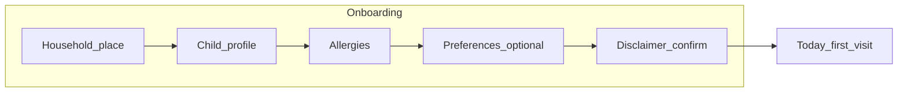

# M1 — High-level hi-fi page design (UX/UI spec)

**Role:** Designer ([`agents/designer.md`](../agents/designer.md)).  
**Source of truth (product):** [`prd-milestone-1.md`](./prd-milestone-1.md).  
**Companion docs:** [`child-nutrition-app-context.md`](./child-nutrition-app-context.md), [`milestone-1-spec.md`](./milestone-1-spec.md), [`suppa-brand-framework.md`](./suppa-brand-framework.md).

This document is **build-ready structure**: layout, hierarchy, components, states, and microcopy—so engineering can implement **without guessing**. Pixel-perfect Figma can mirror this 1:1.

---

## 1. Design goals (from PRD)

| PRD goal | Design response |
|----------|-----------------|
| G1 Core loop | **Obvious path**: Today (**macro snapshot** + **nutrient focus** + meal ideas) → Log → Fridge → **Prep**; persistent **primary CTA** per view. |
| G2 Trust / allergies | **Allergen chips** always visible on recipe surfaces; **safe** iconography (shield/check), never playful on safety copy. |
| G3 Lower cognitive load | **One focal column** on mobile; **progressive disclosure** on onboarding; **plain-language macro gaps** (PRD §7.4); **estimate disclaimer** always visible for numbers. |
| G4 Plan & share | **Meal prep** week view + **dead-simple shared recipe page**; **growth** tucked under Settings to avoid tab overload. |
| Educational, not clinical | Warm palette, **no** hospital red/green “alert” for hints; use **“light on…”** framing; **no** “deficient” copy. |
| Mobile web first | **Thumb zone** CTAs; **44px min** touch targets; bottom nav for app shell. |

---

## 2. Visual system (hi-fi tokens)

### 2.0 Brand (Suppa)

**Product name:** **Suppa** — see [`suppa-brand-framework.md`](./suppa-brand-framework.md) for naming (`SuppaMom`, **SuppaRecipe**, slugs), voice, and surfaces.

- **Landing & auth:** **Suppa** wordmark in **Display** typography (Fraunces); functional screen titles stay plain (“Today,” “Recipes”).  
- **Disclaimers (C1–C2):** Lead with **“Suppa shares…”** / **“Suppa does not…”** so the legal tone names the product.  
- **Catalog (engineering):** Seeded and user recipes in the system map to **SuppaRecipe** where the brand doc calls for a catalog object; user-facing list copy remains **Library** / **Yours** / **My recipes** as below.

### 2.1 Color

| Token | Role | Suggested hex | Notes |
|-------|------|---------------|--------|
| `--bg-page` | Page background | `#FAF8F5` | Warm off-white; reduces clinical coldness. |
| `--surface` | Cards, sheets | `#FFFFFF` | |
| `--text-primary` | Body | `#1C1917` | Stone-900; WCAG on white. |
| `--text-secondary` | Supporting | `#57534E` | |
| `--text-muted` | Hints, meta | `#78716C` | |
| `--border-subtle` | Dividers | `#E7E5E4` | |
| `--accent` | Primary CTA | `#C45C3E` | Warm terracotta—not “error red.” |
| `--accent-hover` | CTA pressed | `#A34A32` | |
| `--success-soft` | Safe / match | `#ECFDF5` bg + `#047857` text | Recipe “safe for profile” badge. |
| `--info-soft` | Hint cards | `#FFFBEB` bg + `#B45309` text | Gentle amber, not alarm. |
| `--focus-ring` | Focus visible | `#2563EB` | 2px outline; meets keyboard users. |

**Do not** use color alone for state: pair with **icon + text** (e.g. allergy filter active).

### 2.2 Typography

| Style | Font (stack) | Size / weight | Use |
|-------|----------------|---------------|-----|
| **Display** | `Fraunces, Georgia, serif` | 28–32px / semibold | Landing headline, Today greeting. |
| **Title** | `Fraunces, Georgia, serif` | 22–24px | Screen titles. |
| **Body** | `Inter, system-ui, sans-serif` | 16px / regular | Default body (min 16px on mobile). |
| **Body small** | Inter | 14px | Secondary lines, card meta. |
| **Label** | Inter | 12px / medium uppercase tracking | Overlines (“PRIMARY CHILD”). |
| **Button** | Inter | 16px / semibold | |

**Line height:** 1.5 body; 1.2 titles.

### 2.3 Spacing & shape

- **Grid:** 4px base; outer page padding **16px** mobile, **24px** tablet+.  
- **Card radius:** `16px`; **chip radius:** full pill.  
- **Elevation:** Card `0 1px 3px rgba(0,0,0,.08)`; modal/sheet slightly stronger.  
- **Max content width (desktop):** `480px` centered for “phone-first” web app column; optional `720px` for recipe detail only.

### 2.4 Breakpoints

| Name | Width | Behavior |
|------|-------|----------|
| `xs` | 320–374 | Single column; bottom nav. |
| `sm` | 375–767 | Same; slightly more horizontal air. |
| `md` | 768+ | Optional **left rail** (icons + labels) or still bottom nav per brand choice; content column max-width centered. |

---

## 3. Navigation & IA (app shell)

**Pattern:** **Bottom tab bar** (mobile web) with **5** tabs; **Settings** + **Growth** use **top gear** (Growth also under Settings—FR-I4).

| Tab | Icon (outline) | Route |
|-----|----------------|--------|
| Today | Sun / home | `/today` |
| Log | Plus in circle (or fork) | `/log` |
| Fridge | Refrigerator | `/fridge` |
| Recipes | Book | `/recipes` |
| Prep | Calendar week | `/meal-prep` |

**Settings:** **Top-right gear** on all authenticated screens (does not consume tab). Optional **Growth** shortcut on Today secondary row—PO pick; spec defaults **Settings → Growth** only.

**Primary CTA duplication:** On **Today**, show **“Log a meal”** as main button **and** Log tab remains—reinforces PRD “one primary action.”

---

## 4. UX flows

### 4.1 Onboarding (post sign-up)

- **Progress:** Step indicator **1–5** (dots or “Step 2 of 5”) at top.  
- **Back:** Allowed except from step 1 (or confirm discard).  
- **Skip:** Only on **likes/dislikes** step (clear “Skip for now” text link).

### 4.2 Core loop (returning user)

Today (scan) → tap **Log** or **primary CTA** → quick log sheet → return to **Today** (updated) → optional **Fridge** for dinner.

---

## 5. Screen-by-screen hi-fi specification

Each block lists: **purpose**, **layout (top → bottom)**, **components**, **states**, **copy**.

---

### 5.1 Landing (unauthenticated)

**Purpose:** Value prop + trust; single path to sign up / log in.

**Layout**

1. **Hero** (full viewport min ~520px mobile): soft gradient or subtle food illustration (abstract shapes—avoid stereotype “mom” clip art).  
2. **Wordmark:** **Suppa** (Display / Fraunces)—master brand on first touch.  
3. **Display** headline: *“Today’s nutrition, clearer.”*  
4. **Body** 2–3 lines: **Suppa** positioning — household nutrition **visible and actionable**; planning and reassurance, **not** clinical care; brief not-medical-advice line (see brand framework §1).  
5. **Primary button** full width: **Create account**  
6. **Secondary** text button: **Log in**  
7. **Footer** tiny: Privacy · Terms (placeholders).

**Components:** **Suppa** wordmark, `ButtonPrimary`, `ButtonGhost`, inline disclaimer text 12px muted.

**States:** None beyond hover/focus on buttons.

---

### 5.2 Sign up / Log in

**Purpose:** FR-A1. Keep **one column**; no split-screen on mobile.

**Layout**

- **Title:** “Create your account” / “Welcome back”  
- **Form fields (M1 — PO):** **Email** and **password** (both required). **Password:** minimum **8 characters** (inline validation + helper text). **Forgot password** (log-in only): link to **Forgot password** screen → user submits **email** → **confirmation state** (“Check your email”) → email contains **one-time link** → **Reset password** screen (new password + confirm, min 8) → return to **Log in**.  
- **Primary:** Continue  
- **Link:** Switch to log in / sign up  
- **Trust line:** “We use your profile to personalize food ideas only.”

**Components:** `TextField` (label above field, 8px gap), `ButtonPrimary`, inline validation under field (error text in `#B91C1C`, icon optional).

**Errors:** Map **duplicate email / account exists** (and similar auth failures) to a **specific** inline message and next step—not a generic “Something went wrong.”

**Accessibility:** Autocomplete attributes; error announced to SR.

**Related screens (M1):** **Forgot password** (email field + submit) · **Reset password** (new password, confirm, both min 8) — same tokens/components as §5.2.

---

### 5.3 Onboarding — Step 1: Household place

**Purpose:** FR-A3; PRD geography (**M1 — PO:** **Indonesia only**).

**Layout**

1. **Title:** “Where do you shop and cook?”  
2. **Subtitle:** **“We’re starting in Indonesia—pick your city or regency.”** (or shorter: helps tune food ideas for your area.)  
3. **City or regency** — **single required `Select`** (kota/kabupaten-level list; curated data—expand over time). **No** free-text city in M1.  
4. **Country:** **not shown** as a control; stored as **`ID`** (Indonesia) in product logic.  
5. **Optional** expandable: “Add another caregiver later” — **hidden for M1** (defer).  
6. **Primary:** Continue  
7. **Secondary:** Back (disabled on step 1).

**Components:** `Select`, stepper.

**Validation:** User must pick **one** list row; block Continue if empty.

---

### 5.4 Onboarding — Step 2: Child profile

**Purpose:** FR-B1, FR-B4.

**Layout**

1. **Title:** “Tell us about your child”  
2. **Child first name** or nickname `TextField`  
3. **Age band** — **vertical radio cards** (large tap targets), one line each:

   - 0–5 months  
   - 6–12 months  
   - 1–2 years  
   - 3–5 years  
   - 6–8 years  
   - 9–11 years  
   - 12 years  

4. **Sex** — **required** `Select` or radio row: **Female** · **Male** · **Prefer not to say**  
   - **Helper (muted):** “Used only for growth charts, if you use them. You can change this later.”  
   - If **Prefer not to say:** Growth feature **hidden** later with explanation (no shame).  

5. **Primary:** Continue

**Hi-fi note:** Selected card: **2px accent border** + soft accent background tint `#FEF3F2`.

---

### 5.5 Onboarding — Step 3: Allergies

**Purpose:** FR-B2; safety UX.

**Layout**

1. **Title:** “Any allergies to avoid?”  
2. **Subtitle:** We hide recipes that don’t match. Always double-check labels.  
3. **Chip grid** (multi-select): Milk, Egg, Peanut, Tree nuts, Wheat, Soy, Fish, Shellfish, Sesame  
4. **Toggle row:** “No known allergies” — **mutually exclusive** with chips (**selecting one clears the other**; first tap wins if user tries both—implement **deterministic** client state). **Server/API** must reject inconsistent payloads (e.g. `no_known_allergies` + non-empty chip list) with a single canonical rule documented in tech spec.  
5. **Other** `TextField` multiline (optional), helper: “We’ll be careful—recipes may hide extra matches.”  
6. **Primary:** Continue

**Components:** `FilterChip` selected = filled accent light bg + border; unselected = outline.

**Accessibility:** Chips are **toggle buttons** with `aria-pressed`.

---

### 5.6 Onboarding — Step 4: Preferences (optional)

**Purpose:** FR-B3.

**Layout**

1. **Title:** “Likes and dislikes (optional)”  
2. **Likes** `TextArea` max 500, placeholder *Loves rice, banana…*  
3. **Does not like** `TextArea` max 500  
4. **Tertiary:** Skip for now  
5. **Primary:** Continue

---

### 5.7 Onboarding — Step 5: Disclaimer

**Purpose:** PRD §8.4.

**Layout**

1. **Icon** small info (not scary).  
2. **Title:** “A quick note”  
3. **Body** 3–4 lines: informational; not medical advice; pediatrician/RD for concerns.  
4. **Checkbox** required: “I understand”  
5. **Primary:** **Get started with Suppa**

**Back navigation:** If user taps **Back** from this step, **uncheck** “I understand” (or reset disclaimer acknowledgement) so they cannot complete onboarding without an explicit re-confirm.

---

### 5.8 Today (authenticated home)

**Purpose:** FR-C1–C7; nutrition modes PRD §7.2–§7.8.

**Persistent estimate line (macro bands only):** Below disclaimer or under macro card title, **12px muted**: *“Numbers are estimates from your quick logs—not exact intake.”* Never hide on first visit.

**Layout (6–12 months, 1–2 years, 3–12 years — macro snapshot)**

1. **Top bar:** Greeting **“Good [morning \| afternoon \| evening], mama — [ChildFirstName]”** (time from device clock; **ChildFirstName** from primary child profile, FR-B1 / PRD FR-C1). **Inclusive note:** English M1 warm **“mama”**; neutral/locale variants are backlog. Child name pill **“Maya · 3–5 years”** (tappable → Settings child section)—may echo the same first name as in the greeting.  
2. **Disclaimer strip** collapsible: one line + “Learn more” expands PRD disclaimer.  
3. **Hero card — “Today for Maya”**  
   - **Energy row:** Label **Energy** + horizontal **progress bar** (estimated kcal / reference kcal) + text **“~520 / 1600 kcal”** (tilde prefix optional; design pick one).  
   - **Macro row:** Three compact **macro bars** or stacked rows: **Protein**, **Carbs**, **Fat** — each shows **~g logged / ~g reference** (or % of day target). Use **same** filled track treatment as energy; **no** red “danger” fill—neutral stone track, **accent** fill for progress.  
   - **Subline (encouragement):** “Aim for balance today—not perfection.”  
   - **Sodium / added sugar row (awareness):** Two compact lines or one combined card—**“Sodium today”** / **“Added sugar today”** with either **~mg / ~g vs mindful line** (when rollup possible from logged recipes—tech spec) **or** neutral **“Not enough detail to estimate—link recipes to meals or add recipe info.”** Never show fake zeros. Reference lines labeled **“general guide for [age], not a prescription.”**  
4. **Nutrient focus** (FR-C6, PRD §7.7) — **below** macro card, **above** macro gap hints:  
   - **Card** `info-soft` or neutral surface; **overline** “Nutrient focus”  
   - **Vitamin D** line: stage-specific one-liner + **“Ask your pediatrician before supplements.”**  
   - **Iron** line (6 mo+): **iron-rich food examples** (plain language)—**not** “you are low.”  
   - **Optional third row:** **Calcium pattern** (“Dairy or fortified soy today?”) for toddler+ — omit when crowded on xs.  
   - **0–5 mo milk mode:** Replace macro block with **short nutrient strip** only (vitamin D edu + milk check-in)—no iron score from solids.  
5. **Macro gap hints** (max 3 cards, PRD §7.4):  
   - `info-soft` background; title **“Today looks light on protein.”** (or carbs / fat / overall energy); body = short food examples **or** in-app link **See meal ideas** (anchor to **Meal ideas for today** on same screen).  
6. **Meal ideas for today** (FR-C5 — **PO:** never a dead end):  
   - **Overline:** “Meal ideas for today”  
   - **When gap-matched ideas exist:** **Horizontal scroll** or vertical **2–3 cards** with **`Helps with protein`** (or matching gap) + **Safe for [child]** when applicable.  
   - **When no logs today or no gap matches:** **Generic browse** — same layout, cards from **allergy-safe** catalog (no gap badge, or neutral **“Safe for [child]”** only); **subline C18**; **always** include **Browse recipes** (full safe list) and, if useful, **Add recipe**. **Never** an empty module without a forward action if **≥1** safe recipe exists.  
   - **True catalog empty (edge):** **C8** + **Browse recipes** + **Add recipe**.  
   - **Tap** → Recipe detail.  
7. **Primary CTA** sticky bottom above tab bar: **Log a meal**  
8. **Secondary row:** **Cook from fridge** (ghost) · **Meal prep** (ghost, links to `/meal-prep`).

**Layout (0–5 months — milk mode) — PO: milk only**

- **No** energy/macro chart for solids. **No** food-group **meal log** — **feed/milk check-in** only (see §5.9).  
- **Single card:** “Mostly breast milk or formula today?” **Toggle or check** once per day.  
- **Optional** small edu card: “Vitamin D is often discussed for infants—ask your pediatrician.” **No dosing.**  
- **No** macro gap hints. **Meal ideas:** **Generic allergy-safe browse** only (not gap-driven)—same **never empty** rule as §5.8.6.  
- **Primary CTA:** **Record a feed** (or **Log today’s milk**) — **not** “Log a meal” for solids.

**Empty state (no logs today, macro bands — 6 mo+)**

- Illustration placeholder.  
- **Title:** “Nothing logged yet today”  
- **Body:** “Add a meal to see how the day is shaping up.”  
- **No** fake macro progress at 0—show **empty bars** or **dashed placeholders** with copy “Log to see estimates.”  
- **Primary:** Log a meal  
- **Meal ideas:** **Always** show **generic safe browse** + **Browse recipes** (**PO**—never dead end).

**Loading:** Skeleton for macro bars + nutrient strip + 2 hint lines + 1 recipe card shimmer.

---

### 5.9 Log — add meal

**Purpose:** FR-D1.

**Pattern:** **Full screen form** on mobile (or bottom sheet **max-height 90%**).

**Layout**

1. **Nav:** Back / close  
2. **Title:** “Log a meal”  
3. **Meal name** `TextField` *Breakfast, Snack…*  
4. **Type** segmented: Meal | Snack  
5. **Food groups** — **multi-select chips** (required): Vegetables, Fruits, Grains, Protein, Dairy / fortified soy, Other (does not count toward macro estimate per PRD—show helper).  
6. **Portion:** Small | Medium | Large (radio row). **Default Medium** if user taps Save without changing (align tech spec). Helper: “Portion adjusts your day’s estimate.”  
7. **Primary:** Save  
8. **Success:** Toast “Saved” + navigate back to **Today** (preferred) or Log list.

**Validation:** PRD AC-D1 / AC-D1b — block save with inline error “Pick at least one food group” and **block `other` alone**. **0–5 months:** **do not use** this screen for solids—route to **Record a feed** / milk check-in (§5.9b).

**Errors / offline:** On **network failure** or **5xx** after Save, show **error toast** (use destructive text color, not alarm red fill) with **Retry**; **preserve** form field values until success or explicit dismiss.

---

### 5.9b Log — feed / milk check-in (0–5 months)

**Purpose:** FR-D1 milk mode; PRD **infant_0_5**.

**Layout**

1. **Nav:** Back  
2. **Title:** “Record a feed” (or “Today’s milk”)  
3. **One-tap or simple pattern:** e.g. **Breast milk** · **Formula** · **Mixed** (or daily **“Logged for today”** check—tech spec). **No** food-group chips.  
4. **Primary:** Save  
5. **Success:** Return to **Today** (milk mode).

**Accessibility:** Same focus/error patterns as §5.9.

**Errors / offline:** Same pattern as §5.9 (toast + Retry; preserve fields).

---

### 5.10 Log — 7-day history

**Purpose:** FR-D2.

**Layout**

1. **Title:** “This week”  
2. **Grouped list** by day (sticky subheaders **Today**, **Yesterday**, **Friday Mar 28**).  
3. **Row:** time optional, meal name, **mini chip row** of food groups (dots or abbreviations); optional **~P/C/F** micro text if space (prototype may omit).  
4. **FAB or empty:** **+ Log** (same as primary).

**Empty week:** “No meals logged yet” + CTA.

---

### 5.11 Fridge — ingredients

**Purpose:** FR-E1.

**Layout**

1. **Title:** “What’s in your fridge?”  
2. **Subtitle:** We’ll match **safe** recipes for **[Child name]**.  
3. **Allergen recap** read-only chips (from profile)—tap → Settings.  
4. **Tag input** or repeating `TextField` + **Add** for each ingredient (M1 simple: **comma-separated** field acceptable if PO agrees—design prefers chip input for clarity).  
5. **Primary:** **Find recipes**  
6. **Disclaimer** footnote small.

**Validation:** **Disable** “Find recipes” (or show inline error) when **no** ingredients entered after trim—avoid empty searches.

**Loading:** Button spinner; then navigate to results **same page** below fold or **results screen**.

**Errors:** On **timeout** or **API error**, show inline or full-width error with **Retry**; **retain** ingredient input.

---

### 5.12 Fridge — results

**Purpose:** FR-E2, E3.

**Layout**

1. **Title:** “Recipes for you”  
2. **Sort label** (static M1): “Best match for your fridge” (optional suffix when gap-boost on: **· Prioritizes today’s gaps**).  
3. **Recipe cards** (vertical list):  
   - Thumbnail placeholder 16:9  
   - Title  
   - **Meta row:** **Clock icon · ~35 min** (or **Active 15m · Total 35m** when `active_minutes` present); omit if missing.  
   - **Badge row:** `Safe for Maya` (success-soft) · **3/5 fridge match** (muted) · optional **`Helps with protein`** (info-soft outline) when recipe matches a **current-day macro gap**  
   - **Deprioritized dislike** badge (amber outline): “May contain a food they avoid—open to check”  
4. **Tap** → Recipe detail.

**Errors:** Same as §5.11—recoverable failure state with Retry when suggestion generation fails.

**Empty state (PRD §9.2)**

- **Title:** “No matches yet”  
- **Body:** “Try fewer ingredients or update your child’s profile.”  
- **Actions:** Edit ingredients · **Settings**

---

### 5.13 Recipe detail

**Purpose:** View seeded / user recipe; analytics `recipe_view`; FR-E6, FR-H1–**H5**.

**Layout**

1. **Top bar:** **Back** · **Share** (opens **Share sheet**—item 9 below).  
2. **Hero image** optional placeholder  
3. **Title** + source pill **Library** | **Yours**  
4. **Cook time row:** **Total ~35 min** (required display when `total_minutes` on seeded; show **“Time not set”** muted for user recipe if empty—encourage fill in edit). Optional **Active 15 min** subline.  
5. **Safety callout** if child profile: green inline **“Matches your allergy settings”** (only when true—never lie), computed **at load** from current profile. If **allergies or child** change while this screen is open (another tab/device), show a **dismissible banner**: “Profile updated—tap to refresh safety check” and **recompute** on tap.  
6. **Macro line** (when data present): *Per serving · ~320 kcal · 18g protein · 30g carbs · 12g fat* + **`macro_emphasis`** pill e.g. **Protein-forward** (muted, not clinical). Optional **Sodium ~X mg · Added sugar ~Y g** when recipe fields present. Omit macro row if user recipe has no macro fields.  
7. **Ingredients** bulleted  
8. **Steps** numbered **large type** (min **18px** body for steps on mobile—helps tired users).  
9. **Share sheet** (modal / bottom sheet):  
   - **Copy link** — copies **unguessable URL** to §5.16 public page; toast “Link copied.” If user **revoked** earlier, this **mints a new token** (PRD FR-H5).  
   - **Print or PDF** — opens public page in **new tab** with **`?print=1`** or triggers **window.print()** after navigation; print CSS removes nav.  
   - **Copy recipe text** — plain text (title, times, ingredients, steps) to clipboard.  
   - **Revoke share link** — **destructive-style** row or button; **confirm dialog** (C20/C21). On confirm: invalidate token, toast **“Share link revoked”**, sheet can show **muted** “Previous links no longer work.” **Library/seeded (“Library”) recipes (M1 default):** **hide** revoke **or** show disabled state with helper “Editorial recipes use a shared link managed by Suppa”—PO/eng pick one; **“Yours”** always shows revoke.  
   - **Helper:** “Only the recipe is shared—not your child’s profile.”  
10. **Sticky bottom:** **Back** (if not duplicating top).

---

### 5.14 Recipes — library list

**Purpose:** FR-E3, FR-E5 browse.

**Layout**

1. **Title:** “Recipes”  
2. **Trending strip** (horizontal scroll) **above** main list when ≥1 seeded recipe has **`trending: true`**:  
   - **Overline:** “Trending” (small label, accent or neutral per brand)  
   - **Cards:** compact (image + title + **time**); **Trending** pill on card.  
3. **Segmented:** **For you** (safe + optional fridge context if last run cached—**optional M1**) | **All safe** | **Mine**  
4. **Search** field optional stretch  
5. **Card list** as in 5.12 without match % unless fridge context; show **macro emphasis** pill + **cook time** when available; **Trending** badge inline if also in strip (dedupe visually).  
6. **FAB / top:** **+ Add recipe**

---

### 5.15 Add recipe (user)

**Purpose:** FR-E4.

**Layout**

1. **Title:** “New recipe”  
2. **Title** field  
3. **Ingredients** large `TextArea` (helper: “One per line”)  
4. **Steps** `TextArea`  
5. **Tags** optional chip or text  
6. **Cook time (optional)** — **Total minutes** number field; optional **Active minutes** (hands-on). Helper: “Helps with **Meal prep** totals and recipe cards.”  
7. **Macros (optional)** — collapsible **“Add nutrition per serving (for Today meal ideas)”**: numeric fields **Calories**, **Protein (g)**, **Carbs (g)**, **Fat (g)**; **Emphasis** single-select: Balanced | Protein | Carbs | Fat. Helper: “Optional. Needed to show this recipe in **Meal ideas for today**.”  
8. **Sodium / sugar (optional)** — collapsible **“Add sodium & added sugar (per serving)”**: **Sodium (mg)**, **Added sugar (g)**. Helper: “Optional. Improves **Today** awareness when you cook this recipe.”  
9. **Disclaimer:** “You’re responsible for accuracy; we use this for suggestions only.”  
10. **Primary:** Save recipe

**Validation:** Block save if **title** empty, **ingredients** empty/whitespace, or **steps** empty/whitespace (FR-E4); inline errors per field.

**Success:** Navigate to recipe detail or list with toast.

---

### 5.16 Public / shared recipe page (minimal, unauthenticated)

**Purpose:** FR-H1, FR-H2, FR-H4; **newbie-mom** readability; **no** app chrome, **no** child PII.

**Audience:** Anyone with **link**; may be first touch with brand—keep **warm** but **ultra-simple**.

**Layout**

1. **Max width** `640px` centered; **background** white or `#FAF8F5`; **padding** `24px`  
2. **Product wordmark** small top: **Suppa** (optional link to marketing site—PO)  
3. **Title** — **serif Display 28–32px**, line-height tight  
4. **One-line meta:** **Total time ~X min** (optional **Active Y min**)  
5. **Optional** per-serving nutrition as **plain sentence** (not dense table)  
6. **Ingredients** — heading **18px sans semibold**; list **18px**, **line-height 1.7**, generous spacing  
7. **Steps** — heading + **numbered list**; each step **20–22px** body, **1.7** line-height; **plenty of vertical gap** between steps  
8. **Footer** — **12px muted** disclaimer (PRD §8.4) + “Not medical advice.”  
9. **Print:** `@media print` hide wordmark link; **black text**; **page-break-inside: avoid** on list items where supported  

**Do not show:** allergies, child name, Today, nav tabs, sign-in prompts (optional tiny “Made with Suppa” only).

---

### 5.17 Weekly meal prep

**Purpose:** FR-G1–G5.

**Layout**

1. **Title:** “This week’s plan”  
2. **Subtitle:** “For **[Child name]** · recipes stay allergy-safe when picked from the app”  
3. **Week strip** — **7 columns** on `md+`; **vertical list of days** on `xs` (Mon–Sun with **date** sublabel)  
4. **Per day** expandable **meal slots** (defaults: **Breakfast · Lunch · Dinner · Snack**—collapsible to save space):  
   - **Empty slot:** **“Add recipe”** → picker **filtered** by §8.2 (blocked recipes **not** selectable; **inline error** if edge case)  
   - **Filled slot:** recipe title + **time meta** + **⋯** menu **Remove**  
   - **Note slot** (FR-G3): **“Add a note”** free text—show **amber helper** “We can’t check notes for allergies.”  
5. **Summary card** (bottom): **“Planned meals: N”** · **“Rough cook time: ~Xm”** when minutes known; **omitted** if no times  
6. **Primary:** **Save week** (toast “Saved”)  
7. **Secondary:** **Clear week** (confirm dialog)  

**Empty week:** CTA **“Start with a recipe”** → navigates to **Recipes** safe list.

---

### 5.18 Growth — measurements & chart

**Purpose:** FR-I1–I4.

**Entry:** Settings → **Growth** row.

**Layout — list + add**

1. **Title:** “Growth”  
2. **Disclaimer card** (always visible): **C9** (see §7) — chart is **reference only**; **not** a diagnosis; talk with **pediatrician**.  
3. **If sex is prefer not to say:** **Empty state** with illustration-light; **“Growth charts need sex at birth for standard curves.”** · button **Update child profile**  
4. **Add measurement** button → form sheet:  
   - **Date** picker  
   - **Weight** + unit **kg / lb**  
   - **Length / height** + unit **cm / in**  
   - **Measurement type:** **Lying down (length)** vs **Standing (height)** — helper text by age (e.g. under 2 often length)  
   - **Save**  
5. **History** list: newest first, **one line per entry**  

**Layout — chart**

6. **Simple line or point chart** vs **shaded percentile band** (engineering + chart lib—design provides **mock**):  
   - **Y-axis:** weight or length/height (one metric per view; **toggle** Weight | Height)  
   - **X-axis:** age (computed from **age band + measurement dates**—exact age calc in tech spec; may use **decimal age** from band midpoint **only if** no DOB—**PO:** prefer **months since birth** entry later or use band anchor—**open**; design shows **generic “age along bottom”** until eng locks)  
7. **Annotation:** **dot** for each entry; **copy** below chart: **“This point is near the typical range on [WHO/CDC] charts for [girls/boys].”** — **never** “normal/abnormal.”  
8. **Single point:** show dot + **“One reading—trends matter more. Ask your doctor how often to measure.”**

---

### 5.19 Settings

**Purpose:** FR-F1, FR-B5.

**Layout (grouped list)**

1. **Household** → **City/regency** (`Select`, same list pattern as onboarding); **Indonesia** implied—no country picker M1.  
2. **Child profile** → Name, age band, **sex**, allergies, likes/dislikes  
3. **Mindful eating guides** (**PO:** **editable**) → **default** sodium (**mg/day**) and added sugar (**g/day** or qualitative **under 2**) per PRD §7.8; **numeric fields or pickers** + **Reset to defaults**; helper **“From general guidelines—not for your child’s medical plan.”**  
4. **Growth** → navigates to §5.18  
5. **Account** → Sign out  
6. **About** → Disclaimer full text

**Use** `ListGroup` iOS-style rows with chevrons; destructive **Sign out** in red text at bottom.

---

## 6. Component inventory (M1)

| Component | Variants | Notes |
|-----------|----------|--------|
| `ButtonPrimary` | default, loading, disabled | Full width mobile. |
| `ButtonSecondary` | outline | |
| `ButtonGhost` | text | |
| `TextField` | default, error | Label always visible. |
| `TextArea` | — | Min height 120px. |
| `Select` | — | Native or styled. |
| `FilterChip` | selected, default | Allergies + food groups. |
| `MacroBar` | energy, protein, carbs, fat | Labeled progress; track + fill; optional tilde on numbers. |
| `MealIdeaCard` | thumbnail, title, gap badge, safe badge | Horizontal scroll on Today. |
| `MacroEmphasisPill` | protein, carbs, fat, balanced | Recipe surfaces. |
| `Card` | default, hint, safety | |
| `DisclaimerBanner` | collapsed, expanded | |
| `StepIndicator` | steps 1–N | |
| `BottomNav` | **5** items | Today, Log, Fridge, Recipes, Prep. |
| `Toast` | success, error | |
| `EmptyState` | illustration slot + title + body + CTA | |
| `RecipeListItem` | with badges, **cook time** | |
| `TrendingStrip` | horizontal scroll | Recipes §5.14 |
| `TrendingBadge` | on card | |
| `CookTimeMeta` | total, optional active | List + detail |
| `ShareSheet` | link, print, text, **revoke** (confirm) | Recipe detail |
| `PublicRecipeLayout` | print + mobile | §5.16 |
| `NutrientFocusCard` | vitamin D, iron, calcium pattern | Today §5.8 |
| `AwarenessRow` | sodium, added sugar, unknown | Today |
| `MealprepWeek` | day grid, slots | §5.17 |
| `GrowthChart` | weight/height toggle, band | §5.18 |

---

## 7. Content deck (microcopy)

| ID | Location | Copy |
|----|----------|------|
| C1 | Today disclaimer (short) | “Suppa shares general food ideas, not medical advice.” |
| C2 | Today disclaimer (expand) | “Suppa does not diagnose or treat conditions. For feeding or allergy concerns, talk with your pediatrician or a registered dietitian.” |
| C3 | Allergy step | “Always read food labels—ingredients can change.” |
| C4 | Fridge footnote | “Suggestions match the allergies you listed. Extra ‘Other’ text is matched carefully and may hide recipes—edit your profile if this feels too strict. When in doubt, skip the recipe.” |
| C5 | Validation food group | “Choose at least one food group for this meal.” |
| C6 | Empty fridge results | “No matches yet. Try fewer ingredients or update your child’s profile.” |
| C7 | Macro estimate disclaimer | “Numbers are estimates from your quick logs—not exact intake.” |
| C8 | Meal ideas (catalog edge) | “We don’t have matching ideas yet—browse all safe recipes or add your own.” |
| C18 | Meal ideas (generic browse / no logs) | “You haven’t logged today—here are safe recipes to explore. Log a meal for ideas matched to your day.” |
| C9 | Growth (persistent) | “This chart uses standard growth references. It’s not a medical test. Your pediatrician is the best judge of your child’s growth.” |
| C10 | Sodium/sugar unknown | “We don’t have enough detail to estimate today—link meals to recipes with sodium/sugar, or add those fields to your recipes.” |
| C11 | Share sheet helper | “Only the recipe is shared—not your child’s profile or allergies.” |
| C12 | Public recipe footer | “General food information only—not medical advice.” |
| C13 | Meal prep note warning | “We can’t check free-text notes for allergies—always verify before serving.” |
| C14 | Nutrient focus (vitamin D) | “Many families discuss vitamin D with their pediatrician—ask what’s right for your baby.” |
| C15 | Today greeting (template) | “Good [morning \| afternoon \| evening], mama — [ChildFirstName]” (see §5.8). |
| C16 | Forgot-password confirmation | “If that email has a Suppa account, we sent a reset link.” (avoid account enumeration—exact copy with Architect). |
| C17 | Reset password success | “Password updated. You can log in.” |
| C19 | Mindful lines reset | “Restored default guide lines for your child’s age.” |
| C20 | Revoke share (confirm title) | “Revoke this share link?” |
| C21 | Revoke share (confirm body) | “Anyone with an old link won’t see this recipe anymore. You can create a new link with Copy link.” |
| C22 | Share link revoked (toast) | “Share link revoked.” |

*(Product name **Suppa** is locked for M1 marketing and in-app disclaimers; see [`suppa-brand-framework.md`](./suppa-brand-framework.md).)*

---

## 8. Accessibility (WCAG-minded)

**Target:** **WCAG 2.2 Level AA** for M1 web unless PO explicitly scopes down (document any exception).

- **Contrast:** Body text on white ≥ 4.5:1; large text ≥ 3:1.  
- **Touch targets:** ≥ 44×44px for chips and nav.  
- **Focus:** Visible `focus-ring` on all interactive elements.  
- **Motion:** Respect `prefers-reduced-motion` (disable large parallax on landing).  
- **Hints:** Announce as **“Tip”** in SR, not **“Warning.”**

---

## 9. Open design issues (for PO / Architect)

**PO-first order:** Resolve in the sequence in [`prd-milestone-1.md`](./prd-milestone-1.md) **§14.1** (maps each item below to PRD questions and screens).

1. ~~**App name**~~ **Locked:** **Suppa** ([`suppa-brand-framework.md`](./suppa-brand-framework.md)). **Open:** final marketing headline variants on Landing (A/B or PO pick).  
2. ~~**Auth**~~ **Locked (M1):** **Email + password** — see PRD FR-A1 / §14 **Resolved**.  
3. ~~**0–5 mo logging**~~ **Locked:** **Milk / feed check-in only** — §5.8 milk mode; §5.9b.  
4. **Fridge input:** comma-separated vs chip field—engineering + design tradeoff.  
5. **Illustrations:** commission vs abstract shapes for M1.  
6. **Bahasa Indonesia:** mirror layout for longer strings (headline wrapping, button length).
7. **Nutrition mapping:** Confirm eng mapping from **each** onboarding age band (§5.4) to PRD §7.2 **nutrition row** for macro targets—no silent sub-band logic.  
8. **Gap threshold:** Define % below reference that triggers a **macro hint** (technical spec).  
9. ~~**Meal ideas / no logs**~~ **Locked:** **Generic browse** + CTA — §5.8.6.  
10. **Growth X-axis** when only **age band** (no DOB)—eng must lock age representation before visual finalization.  
11. **WHO → CDC chart switch** at 24 mo—single screen vs handoff UX.  
12. ~~**Share revoke**~~ **Locked (M1):** **Revoke** in share sheet — PRD FR-H5; **Library** recipe policy (hide vs disabled) with eng.  
13. ~~**Sodium/sugar**~~ **Locked:** **Defaults + user-adjustable** in Settings — §5.19.  
14. **Today:** sodium row placement—inside hero card vs separate card (a11y scan).

---

## 10. Handoff checklist

- [ ] PO approves copy deck **C1–C22** and screen list (incl. §5.16–5.19, forgot/reset auth, §5.9b feed log, **share revoke**).  
- [ ] Frontend: tokens as CSS variables / Tailwind theme.  
- [ ] QA: cross-reference **acceptance criteria** in PRD §11 with **states** above.  
- [ ] Optional: Figma file created from this spec (same section numbering).
- [ ] Review [`m1-bmad-review-ar-ech.md`](./m1-bmad-review-ar-ech.md) JSON paths for test cases.  
- [ ] Review [`m1-bmad-review-ar-macro-redesign.md`](./m1-bmad-review-ar-macro-redesign.md) and [`m1-bmad-review-ech-macro-redesign.json`](./m1-bmad-review-ech-macro-redesign.json) for macro-era gaps.  
- [ ] Review [`m1-bmad-review-ar-ech-m1-expansion.md`](./m1-bmad-review-ar-ech-m1-expansion.md) for M1 expansion (share, growth, meal prep).

---

## References

- [`prd-milestone-1.md`](./prd-milestone-1.md)  
- [`child-nutrition-0-12-knowledge-base.md`](./child-nutrition-0-12-knowledge-base.md)  
- [`m1-bmad-review-ar-ech.md`](./m1-bmad-review-ar-ech.md) — BMad AR + Edge Case Hunter log  
- [`m1-bmad-review-ar-ech-m1-expansion.md`](./m1-bmad-review-ar-ech-m1-expansion.md) — M1 expansion AR/ECH  
- [`agents/designer.md`](../agents/designer.md)

---

## Document change log

| Version | Date | Notes |
|---------|------|--------|
| 0.1 | 2026-04-05 | Initial M1 hi-fi page spec from PRD. |
| 0.2 | 2026-04-05 | Post–BMad AR/ECH: country validation, allergy mutual exclusivity, disclaimer back, Today greeting, network/error states, fridge empty validation, recipe stale safety, add-recipe validation, WCAG AA target, C4 copy, handoff QA note. |
| 0.3 | 2026-04-05 | Macro-anchored Today (§5.8), portion helper on log (§5.9), fridge/recipe macro badges (§5.12–5.14), recipe detail macro line (§5.13), add-recipe optional macros (§5.15), components C7–C8, open issues 8–9. |
| 0.4 | 2026-04-05 | **M1 expansion:** 5-tab nav + Prep; onboarding **sex**; Today **nutrient focus** + **sodium/sugar awareness**; **Trending** + **cook time** on lists; recipe **Share sheet** + §5.16 **public page**; §5.17 **meal prep**; §5.18 **Growth**; §5.19 Settings **mindful guides**; new components; C9–C14; open issues 10–14. |
| 0.5 | 2026-04-05 | **Suppa** branding: §2.0 brand block; landing §5.1 wordmark + positioning; onboarding CTA; C1–C2; §5.16 footer; open issue 1 (app name) locked; prototype `styles.css` wordmark utilities. |
| 0.6 | 2026-04-06 | §9 pointer to PRD §14.1 **PO-first** resolution order. |
| 0.7 | 2026-04-06 | §5.2 + §9: **email + password** auth locked (PRD Q1). |
| 0.8 | 2026-04-06 | Forgot-password + reset screens; **8-char** password; Today **mama + child** greeting (PRD Q6); C15–C17; handoff C1–C17. |
| 0.9 | 2026-04-06 | **Indonesia** city dropdown §5.3; milk mode §5.8; **generic meal ideas** C18; **§5.9b** feed log; Settings **editable** mindful lines C19; §9 closures. |
| 1.0 | 2026-04-06 | Share sheet **revoke** (FR-H5); C20–C22; `ShareSheet` component; §9.12 locked. |
