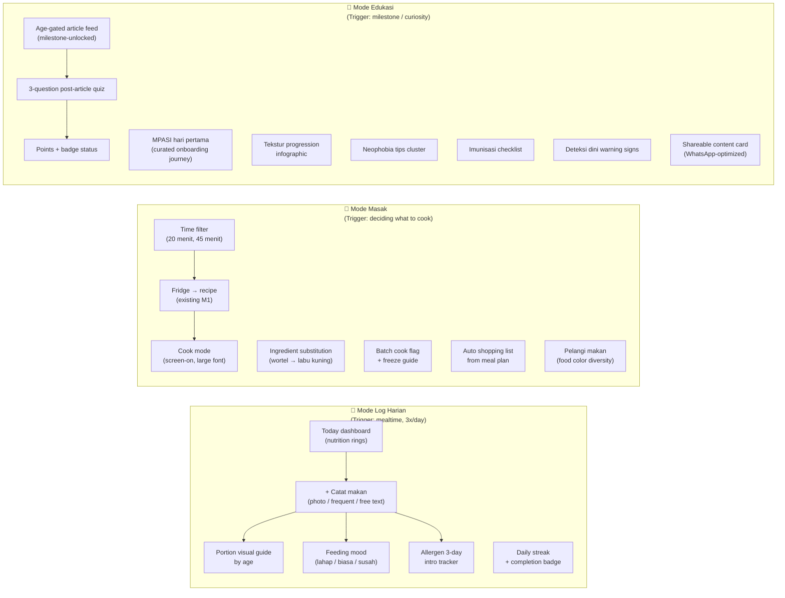

# Suppa — Vision & Feature Brainstorm

**Status:** Living document — update as decisions are made  
**Created:** 2026-04-09  
**Owner:** Alvin  
**Session agents:** CPO · Designer · Product Owner  

> This document captures the expanded vision-mission tree, mode-based feature map, seed data needs, and research agenda for Suppa. It is the strategic complement to `[child-nutrition-app-context.md](../../Child%20Nutrition%20App/child-nutrition-app-context.md)` and lives above M1 spec scope.

---

## Resolved Decisions (from brainstorm session)

| #   | Decision            | Choice                                  | Rationale                                                   |
| --- | ------------------- | --------------------------------------- | ----------------------------------------------------------- |
| 1   | Mode switching      | **Explicit** — 3 tabs in bottom nav     | Simpler to build; gives moms a clear mental model           |
| 2   | Gamification depth  | **Low effort** — streaks + badges only  | Reasonable retention, low design/backend cost               |
| 3   | Product positioning | **Education platform that also tracks** | Mode Edukasi is first-class; tracking serves learning goals |

---

## 1. Vision-Mission Tree (Expanded)

```mermaid
graph TD
    Vision["🎯 VISION\nNutrisi semua anak tercukupi"]

    Vision --> M1["📚 Educated Mom"]
    Vision --> M2["🥗 Anak menerima\nmakanan dengan baik"]
    Vision --> M3["💪 Anak Sehat Jasmani"]
    Vision --> M4["📊 Nutrisi tercukupi"]
    Vision --> M5["🤝 Membantu orang tua"]
    Vision --> M6["👨‍👩‍👧 Keterlibatan keluarga"]

    M1 --> M1a["Literasi nutrisi\n(labels, food groups)"]
    M1 --> M1b["Kebersihan alat makan"]
    M1 --> M1c["Kepercayaan diri ibu\n(self-efficacy)"]
    M1 --> M1d["Komunitas peer\n(validation, shared learning)"]
    M1 --> M1e["Deteksi dini masalah gizi\n(when to see a doctor)"]

    M2 --> M2a["Presentasi makanan"]
    M2 --> M2b["Tekstur makan\n(progression by age)"]
    M2 --> M2c["Kesehatan oreomolar"]
    M2 --> M2d["Sensory exploration\n(warna, aroma, rasa)"]
    M2 --> M2e["Jadwal makan sesuai usia"]
    M2 --> M2f["Dukungan neophobia\n(10–15 exposure rule)"]

    M3 --> M3a["Grafik pertumbuhan WHO\n+ growth velocity"]
    M3 --> M3b["Imunisasi\n(PPI schedule)"]
    M3 --> M3c["Healthy gut\n(fiber, probiotic foods)"]
    M3 --> M3d["Pemenuhan vitamin\n(D, A, iron, zinc priority)"]
    M3 --> M3e["Nutrisi seimbang\n(macro targets by age)"]
    M3 --> M3f["Minat makan anak\n(appetite mood tracking)"]
    M3 --> M3g["Food diversity\n(Pelangi makan score)"]

    M4 --> M4a["Track macro micro\nvitamin fiber"]
    M4 --> M4b["Allergen tracking\n(3-day intro rule)"]
    M4 --> M4c["Food diversity score\n(WHO IYCF aligned)"]
    M4 --> M4d["Nutrition adequacy\nweekly trend"]

    M5 --> M5a["Mealplan"]
    M5 --> M5b["Belanja\n(auto shopping list)"]
    M5 --> M5c["Masak\n(recipe + cook mode)"]
    M5 --> M5d["Evaluasi\n(weekly score closes loop)"]
    M5 --> M5e["Budget-aware planning\n(bahan Rp 50K tier)"]
    M5 --> M5f["Batch cook + freeze guide"]

    M6 --> M6a["Partner/nenek education mode"]
    M6 --> M6b["Shared meal plan view"]
    M6 --> M6c["Caregiver reference card\n(boleh / tidak boleh)"]
```

---

## 2. Three-Mode Architecture

The app surfaces three **explicit modes** as first-class bottom nav tabs. Each mode owns a distinct behavioral moment in the mom's day.

### Mode default by time of day (contextual hint, not forced)

| Time        | Default surface opens to      |
| ----------- | ----------------------------- |
| 06:00–09:00 | Mode Log Harian (breakfast)   |
| 10:00–13:00 | Mode Masak (lunch planning)   |
| 15:00–17:00 | Mode Log Harian (snack)       |
| 20:00–22:00 | Mode Edukasi (quiet learning) |

---

## 3. Full Feature Map (by mode + mission)

### Core loop (always visible, all modes)

| Feature                                                | Mission pillar     | Priority |
| ------------------------------------------------------ | ------------------ | -------- |
| Child profile (name, age band, allergies, dislikes)    | All                | M1 ✅     |
| Daily nutrition gauge (macro rings, color-coded)       | Nutrisi            | M1 ✅     |
| Nutrient gap daily insight (1–3 hints, plain language) | Nutrisi            | M1 ✅     |
| WHO growth chart + velocity indicator                  | Anak Sehat Jasmani | M1 ✅     |

### Mode Log Harian

| Feature                                             | Mission pillar        | Status  |
| --------------------------------------------------- | --------------------- | ------- |
| Photo meal log (diary / future AI pre-fill)         | Nutrisi               | Post-M1 |
| Frequent foods shortcut (1-tap recurring meals)     | Membantu orang tua    | Post-M1 |
| Portion size visual guide by age band               | Educated Mom          | Post-M1 |
| Feeding mood tracker (lahap / biasa / susah)        | Anak menerima makanan | Post-M1 |
| Allergen 3-day introduction tracker                 | Nutrisi               | Post-M1 |
| Daily logging streak + completion badge             | Gamification          | Post-M1 |
| Texture progression tracker ("siap naik tekstur?")  | Anak menerima makanan | Post-M1 |
| Milestone feeding checklist (in-flow, not separate) | Educated Mom          | Post-M1 |

### Mode Masak

| Feature                                       | Mission pillar     | Status  |
| --------------------------------------------- | ------------------ | ------- |
| Fridge → recipe suggestion                    | Membantu orang tua | M1 ✅    |
| Time-based recipe filter (20 / 45 min)        | Membantu orang tua | Post-M1 |
| Cook mode (distraction-free, screen stays on) | Membantu orang tua | Post-M1 |
| Ingredient substitution engine                | Membantu orang tua | Post-M1 |
| Batch cook flag + freeze portion guide        | Membantu orang tua | Post-M1 |
| Auto shopping list generated from meal plan   | Membantu orang tua | Post-M1 |
| Pelangi makan — food color diversity visual   | Anak Sehat Jasmani | Post-M1 |
| Budget-aware filter (bahan di bawah Rp 50K)   | Membantu orang tua | Post-M1 |
| "Resep baru dicoba" badge                     | Gamification       | Post-M1 |
| Weekly meal prep planner (7-day)              | Membantu orang tua | M1 ✅    |

### Mode Edukasi

| Feature                                               | Mission pillar        | Status  |
| ----------------------------------------------------- | --------------------- | ------- |
| Age-gated article feed (milestone-unlocked)           | Educated Mom          | Post-M1 |
| Post-article 3-question quiz                          | Educated Mom          | Post-M1 |
| Points + badge system with visible profile status     | Gamification          | Post-M1 |
| MPASI hari pertama curated journey (age = 6m trigger) | Educated Mom          | Post-M1 |
| Tekstur progression infographic                       | Anak menerima makanan | Post-M1 |
| Neophobia support tips cluster                        | Anak menerima makanan | Post-M1 |
| Imunisasi schedule checklist (PPI)                    | Anak Sehat Jasmani    | Post-M1 |
| Deteksi dini warning signs content                    | Educated Mom          | Post-M1 |
| WhatsApp-optimized shareable content card             | Komunitas peer        | Post-M1 |
| Bookmark / save for later                             | Educated Mom          | Post-M1 |

### Family & Community

| Feature                                               | Mission pillar        | Status |
| ----------------------------------------------------- | --------------------- | ------ |
| Caregiver reference card (boleh / tidak boleh by age) | Keterlibatan keluarga | Future |
| Shared meal plan view for partner/nenek               | Keterlibatan keluarga | Future |
| Partner education mode (lite profile)                 | Keterlibatan keluarga | Future |
| Peer community feed (curated, moderated)              | Educated Mom          | Future |

---

## 4. Seed Data Requirements

Minimum viable data to launch Mode Edukasi and accurate nutrition tracking.

### Priority 1 — Launch blockers

| Dataset                               | Source                                 | Notes                                                                                          |
| ------------------------------------- | -------------------------------------- | ---------------------------------------------------------------------------------------------- |
| Indonesian food composition (DKBM)    | Kemenkes RI                            | ~2000 foods; focus first 200 MPASI-relevant. Macros + iron, zinc, vit A, vit D, calcium, fiber |
| AKG Indonesia (Indonesian RDA by age) | Permenkes No. 28/2019                  | Age bands: 0–5m, 6–11m, 1–3y, 4–6y. Energy, protein, fat, carbs + key micros                   |
| WHO child growth standards            | WHO Multicentre Growth Reference Study | Weight-for-age, height-for-age, weight-for-height; boys + girls                                |
| MPASI recipe set (curated)            | In-house, IDAI-aligned                 | 60+ recipes: 6–9m puree, 9–12m finger food, 12m+ family. Tagged by protein, budget, prep time  |

### Priority 2 — Mode Edukasi launch

| Dataset                              | Source                  | Notes                                                          |
| ------------------------------------ | ----------------------- | -------------------------------------------------------------- |
| Educational articles                 | In-house editorial      | 5 articles × 5 milestones (6m, 9m, 12m, 18m, 24m) = 25 minimum |
| Quiz question bank                   | Derived from articles   | 10–15 questions per age band = 50 minimum                      |
| Immunization schedule (PPI 2023)     | Kemenkes / IDAI         | Age-mapped, Indonesian national program                        |
| Food allergen cross-reactivity guide | IDAI allergy guidelines | Big 8 + Indonesian-specific: shrimp, kacang tanah, soy/tempe   |
| Portion size visual guide            | IDAI / WHO IYCF         | Age-appropriate serving size (visual, not grams)               |

### Priority 3 — Post-M1 enrichment

| Dataset                                       | Source                  | Notes                                              |
| --------------------------------------------- | ----------------------- | -------------------------------------------------- |
| Common Indonesian meals with MPASI adaptation | In-house + crowdsourced | Nasi tim, bubur sumsum, soto ayam baby-style, etc. |
| Food texture/consistency guide by age         | WHO IYCF, IDAI          | For Tekstur progression tracker                    |
| Probiotic and fiber-rich Indonesian foods     | Research synthesis      | For Healthy gut feature                            |
| Regional food availability by city/kabupaten  | Local research          | For place-aware substitution suggestions           |

---

## 5. Research Agenda

Questions that must be answered before committing Mode Edukasi as the primary positioning.

### User behavior (qualitative — 10–15 mom interviews)

1. What triggers opening a nutrition app vs. asking in a WhatsApp group?
2. What is the minimum logging she will actually sustain? (Not aspirational — real behavior.)
3. How does the 3-mode switch happen naturally in her day — is it time-based, context-based, or mood-based?
4. What is grandparents' / mertua's role in overriding food decisions? What format reaches them?
5. At which age band (6m, 9m, 12m, 18m) does she feel most anxious / most lost?
6. What language register does she prefer: formal "anak Anda" or warm "si kecil"?

### Nutrition science validation

1. Does food diversity score correlate with micronutrient adequacy in Indonesian children 6–24m? (Evidence base for Pelangi makan as a primary metric.)
2. Which micronutrients are most deficient in Indonesian children 6–24m nationally and by region? (Validates track priority — iron, zinc, vit A, iodine suspected.)
3. Does quiz-based education in a mobile app measurably change feeding behavior? (Validates education-first positioning.)

### Product-market

1. Who are real competitors? (Local: Tentang Anak, Primaku; regional: regional parenting apps; global: Huckleberry, BabyCenter.) What do Indonesian moms love/hate?
2. Willingness to pay: which features sit behind a paywall? (Hypothesis: Edukasi content free, personalized tracking premium.)
3. B2B2C angle: Posyandu integration, BPJS, pediatric clinics as distribution channel — worth validating early given government stunting reduction mandate (Perpres No. 72/2021).

### Design validation

1. At what number of taps does the log flow get abandoned? (Quantify friction threshold.)
2. Photo log vs. text log — which has lower friction for Indonesian moms specifically?

---

## 6. Open Questions

| #    | Question                                                                 | Owner         | Status       | Decision                                                                                            |
| ---- | ------------------------------------------------------------------------ | ------------- | ------------ | --------------------------------------------------------------------------------------------------- |
| OQ-1 | How does Mode Edukasi monetize — ad-free freemium, subscription, or B2B? | CPO + Alvin   | **Resolved** | **Ad-free.** No paywall, no ads. Monetization deferred; build trust first.                          |
| OQ-2 | Is Pelangi makan the primary or secondary metric on Today dashboard?     | Designer + PO | **Resolved** | **Secondary.** Macro rings are primary; Pelangi makan is a supporting visual below the fold.        |
| OQ-3 | Does the app need a social/community tab?                                | CPO           | **Resolved** | **No community tab.** WhatsApp share is sufficient. Surface shareable cards throughout all 3 modes. |
| OQ-4 | What triggers MPASI hari pertama onboarding journey?                     | PO            | **Resolved** | **Calendar date** — triggered when child's age reaches 6 months per birth date in profile.          |
| OQ-5 | How to handle 0–5m (milk-only) moms in Mode Edukasi?                     | PO + Designer | **Resolved** | **Separate track** — distinct pre-MPASI content stream. Not hidden or gated. Builds anticipation.   |
| OQ-6 | Caregiver reference card format?                                         | Designer      | **Resolved** | **All formats** — in-app view + WhatsApp-shareable card image + printable/PDF.                      |

---

## 7. Key Quotes from Session (for future reference)

> "Evaluasi has no feedback mechanism. Without a closing loop signal, it is a dead end." — CPO

> "Moms don't read numbers. 'Proteinnya kurang' with a color ring is better than '12g / 25g.'" — Designer

> "Budget-aware meal planning is a real, underserved need for Indonesian moms in tier 2–3 cities." — PO

> "Education must be a pull mode — triggered by mom's intent, not our default homepage." — CPO

---

*Last updated: 2026-04-09 | OQ-1–6 resolved | Next: User behavior research brief → Mode Edukasi content strategy*